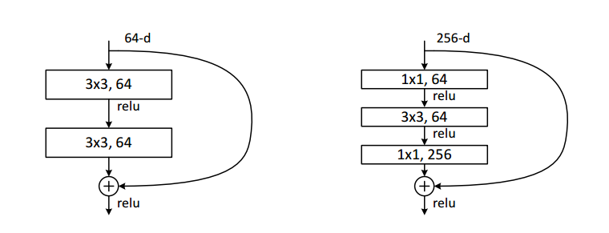
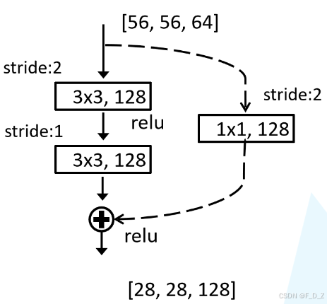
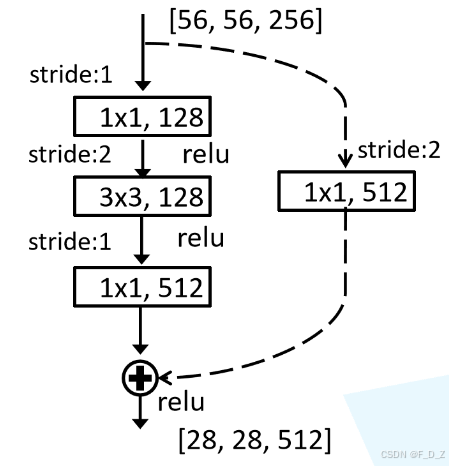
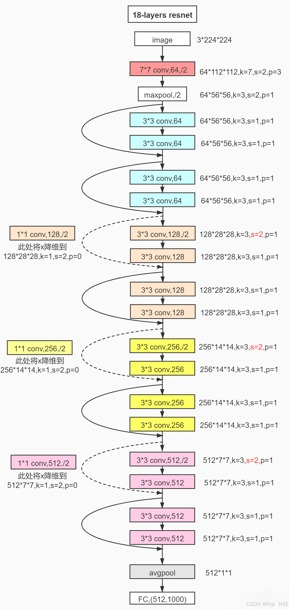
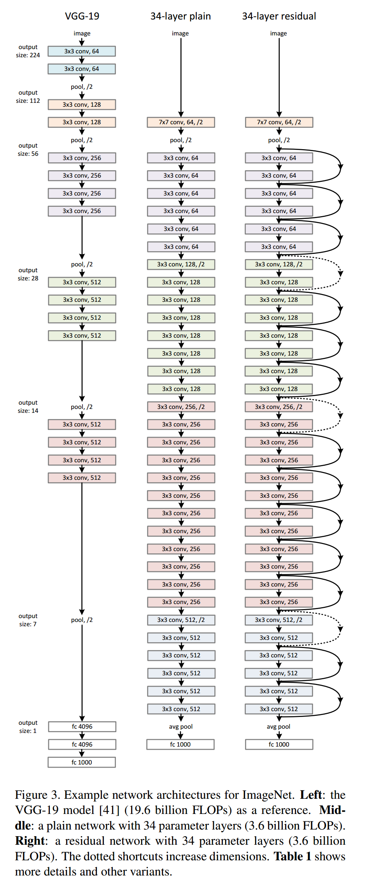
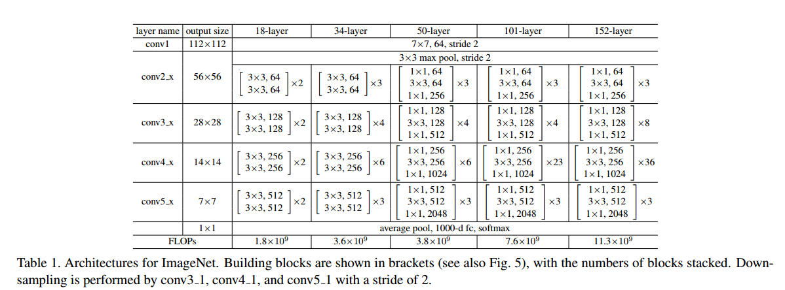
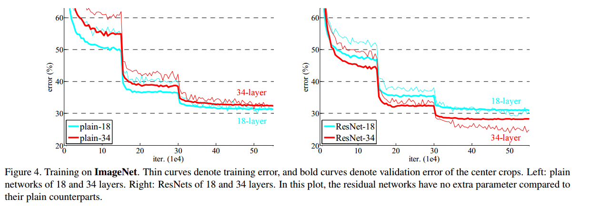
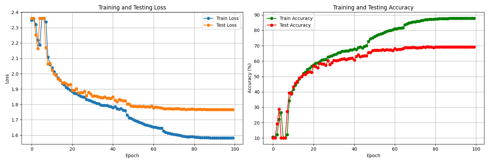

# ResNet残差网络 #


ResNet（Residual Network，残差网络）是一种由微软亚洲研究院提出的深度神经网络结构，其核心在于通过残差连接（residual connections）解决了深层网络训练中的梯度消失和梯度爆炸问题，使得网络可以训练得更深，性能更强。以下是ResNet网络原理、特点、优缺点及应用场景的详细解析。

参考论文：

1.Deep Residual Learning for Image Recognition

https://ieeexplore.ieee.org/document/7780459

2.Identity Mappings in Deep Residual Networks

https://export.arxiv.org/pdf/1603.05027v2.pdf

## 一、ResNet网络原理 ##

ResNet的核心思想是通过残差连接将输入信号直接传递到后面的层，使得网络可以学习到残差而不是全局特征。具体来说，ResNet在每个残差块中引入了一个跨层连接（也称为跳跃连接或shortcut connection），将输入信号直接添加到残差块的输出上。这种设计使得网络在反向传播时能够更容易地传递梯度，从而解决了深层网络训练中的梯度消失问题。
### 1.1深度学习退化现象

在深度学习中，退化现象主要指的是随着神经网络层数的增加，网络性能反而下降的情况。这种现象与人们的直觉相悖，因为通常认为更深的网络能够学习到更复杂的特征表示，从而提高模型的性能。然而，在实际应用中，过深的网络往往会导致梯度消失、梯度爆炸、过拟合以及低级特征丢失等问题，进而引发性能退化。

#### 深度学习退化现象的原因

1.梯度问题：随着网络层数的增加，梯度在反向传播过程中可能会逐渐变小（梯度消失）或变大（梯度爆炸），导致网络无法进行有效的参数更新，从而影响模型的性能。
2.过拟合：深度网络具有强大的表达能力，容易在训练数据上过度拟合，导致在测试集上的性能下降。
3.低级特征丢失：过深的网络可能过于关注高级特征的学习和表达，而忽略了低级特征的重要性，从而丧失了一些有效的特征表示能力。

#### 深度学习退化现象的解决方案

为了解决深度学习中的退化现象，研究者们提出了多种解决方案，其中最具代表性的是残差网络（ResNet）及其恒等映射机制。

**残差网络（ResNet）**：ResNet通过引入残差结构和恒等映射，使得网络在加深时能够保持或提升性能。残差块中的恒等映射允许输入直接传递到输出，与经过卷积层处理的特征相加，从而缓解了梯度消失和梯度爆炸问题，并有助于保留低级特征。

### 1.2 梯度消失

梯度消失（Gradient  Vanishing）是神经网络训练中，特别是在深层神经网络中常见的一个问题。它指的是在网络的反向传播过程中，用于更新网络权重的梯度变得非常小，以至于几乎不对权重产生任何显著的更新。这种现象通常发生在深层网络的较低层（即靠近输入层的层）。

**数学表达**：
 对于L层网络，第l层的梯度：
$$
\frac{\partial Loss}{\partial W_l}=\frac{\partial Loss}{\partial f_L}\cdot\prod_{k=l}^{L-1}\frac{\partial f_{k+1}}{\partial f_k}\cdot\frac{\partial f_l}{\partial W_l}
$$
当层数L很大时，连乘积项极易变得极小或极大

#### 产生原因

1.深层网络结构：在深层网络中，梯度必须通过多个层次进行反向传播。由于链式法则的作用，当层数很深时，梯度在传播过程中可能会逐渐减小，最终变得非常小，甚至接近于零。
2.激活函数的选择：某些激活函数（如sigmoid函数）的梯度在输入值远离其中心点时会变得非常小，这也会导致梯度消失的问题。当这些激活函数被用于深层网络时，梯度消失的问题会更加明显。

#### 解决方案 

1.改变激活函数：使用梯度不易消失的激活函数，如ReLU（Rectified Linear Unit）及其变体（如Leaky ReLU、PReLU等）。这些激活函数在输入为正时梯度为常数，可以有效避免梯度消失的问题。
2.残差连接：通过引入残差连接（Residual Connections），将当前层的输出与前一层的输入直接相加，形成残差块。这种结构有助于梯度在反向传播过程中直接跳过某些层，从而缓解梯度消失的问题。
3.批标准化：批标准化（Batch Normalization）通过对每一层的输入进行归一化处理，使得每一层的输入分布都保持在一个稳定的范围内。这有助于减少梯度消失的问题，并加速网络的训练过程。
4.优化器选择：选择合适的优化器（如Adam、RMSprop等）也可以在一定程度上缓解梯度消失的问题。这些优化器通常具有自适应的学习率调整机制，可以根据梯度的大小自动调整学习率，从而避免梯度消失或梯度爆炸的问题。

### 1.3 残差学习

在深度学习中，残差学习（Residual Learning）是一种重要的技术，它通过引入残差网络（Residual Networks，简称ResNet）来解决传统深度神经网络在训练过程中遇到的梯度消失和梯度爆炸问题，从而提高网络的训练效果和性能。

#### 残差学习的概念

残差学习是指在网络中通过引入残差块（Residual Block），使得网络能够学习输入与输出之间的残差，而不是直接学习完整的输出。残差块通过跳跃连接（Skip Connection）将输入直接连接到输出，与经过网络处理的特征相加，形成残差学习的基本结构。

$$
\mathbf{y}=\mathcal{F}(\mathbf{x},\{W_{i}\})+\mathbf{x}.
$$

#### 残差学习的原理

**解决梯度消失和梯度爆炸：**

1.传统深度神经网络在训练过程中，随着层数的增加，梯度在反向传播过程中可能会逐渐减小（梯度消失）或增大（梯度爆炸），导致网络难以训练。
2.残差学习通过引入跳跃连接，使得梯度可以直接从深层传递到浅层，避免了梯度在传递过程中的损失和爆炸，从而解决了梯度消失和梯度爆炸问题。

**提高网络性能：**

1.残差网络通过堆叠多个残差块来构建深层网络，每个残差块都能学习到输入与输出之间的残差，这种学习方式有助于网络更好地捕捉数据中的特征信息。
2.残差学习使得网络在加深时能够保持或提升性能，避免了传统深度神经网络在加深时出现的性能退化现象。

###  1.4 恒等映射

恒等映射（Identical Mapping），也被称为恒等函数或单位映射，是数学中的一个重要概念，尤其在集合论和函数论中占据重要地位。以下是对恒等映射的详细解析：
**定义**

对于任意集合A，如果映射f:A→A定义为f(a)=a，即A中的每个元素a都与其自身对应，则称f为A上的恒等映射。简单来说，恒等映射就是“原象”与“象”完全相同的映射。
**性质**

1. **唯一性**：对于任何集合A，都存在唯一的恒等映射。
2. **双射性**：恒等映射是双射的，即它既是单射（每个元素都映射到唯一的元素）也是满射（每个元素都有元素映射到它）。
3. **线性性**：在实数集R或更广泛的线性空间上，恒等映射表现为一条通过原点、斜率为1的直线，具有线性性质。

### 1.5 残差连接的理论解释

考虑传统网络第l层到第L层的映射：
$$
x_{L} = x_{l} + \sum_{i = l}^{L - 1} F(x_{i}, W_{i})
$$
反向传播时梯度：
$$
\frac{\partial Loss}{\partial x_l}=\frac{\partial Loss}{\partial x_L}\cdot\left(1+\frac{\partial}{\partial x_l}\sum_{i=l}^{L-1}F(x_i,W_i)\right)
$$
**关键点**：

1. 梯度包含直接传播项（梯度消失）和残差项
2. 即使残差项很小，梯度也不会完全消失

### 1.5 实线残差模块

左图模块用于浅层网络（ResNet34），右图模块用于深层网络（如ResNet101）



```python
class basic_block(nn.Module):
    '''定义了带实线部分的残差块'''
    def __init__(self,in_channels):
        super(basic_block, self).__init__()
        self.conv1 = nn.Conv2d(in_channels,in_channels,kernel_size=3,stride=1,padding=1)
        self.conv2 = nn.Conv2d(in_channels,in_channels,kernel_size=3,stride=1,padding=1)
    def forward(self, x):
        y = F.relu(self.conv1(x))
        y = self.conv2(y)
        return F.relu(x+y)
```

### 1.6 虚线残差模块

左图模块用于浅层网络（ResNet34），右图模块用于深层网络（如ResNet101）

<center class="half">
    
    
</center>

$$
\mathbf{y}=\mathcal{F}(\mathbf{x},\{W_{i}\})+W_{s}\mathbf{x}.
$$

```python
class basic_block2(nn.Module):
    '''定义了带虚线部分的残差块'''
    def __init__(self,in_channels,out_channels):
        super(basic_block2, self).__init__()
        self.conv1 = nn.Conv2d(in_channels,out_channels,kernel_size=1,stride=2)
        self.conv2 = nn.Conv2d(in_channels,out_channels,kernel_size=3,stride=2,padding=1)
        self.conv3 = nn.Conv2d(out_channels,out_channels,kernel_size=3,stride=1,padding=1)
    def forward(self, x):
        z = self.conv1(x)
        y = F.relu(self.conv2(x))
        y = self.conv3(y)
        return F.relu(y+z)
```



## 二、网络结构



```python
class ResNet_34(nn.Module):
    def __init__(self):
        super(ResNet, self).__init__()
        self.conv1=nn.Conv2d(3,64,kernel_size=7,stride=2,padding=3)
        self.pool=nn.MaxPool2d(kernel_size=3, stride=2, padding=1)

        self.block2_1=basic_block(64)
        self.block2_2=basic_block(64)
        self.block2_3=basic_block(64)

        self.block3_1=basic_block2(64,128)
        self.block3_2=basic_block(128)
        self.block3_3=basic_block(128)
        self.block3_4=basic_block(128)

        self.block4_1=basic_block2(128,256)
        self.block4_2=basic_block(256)
        self.block4_3=basic_block(256)
        self.block4_4=basic_block(256)
        self.block4_5=basic_block(256)
        self.block4_6 = basic_block(256)

        self.block5_1 = basic_block2(256,512)
        self.block5_2 = basic_block(512)
        self.block5_3 = basic_block(512)

        self.avgpool = nn.AdaptiveAvgPool2d((1, 1))
        self.fc = nn.Linear(512,200)


    def forward(self,x):
        x = self.conv1(x)
        x = self.pool(x)

        x = self.block2_1(x)
        x = self.block2_2(x)
        x = self.block2_3(x)

        x = self.block3_1(x)
        x = self.block3_2(x)
        x = self.block3_3(x)
        x = self.block3_4(x)

        x = self.block4_1(x)
        x = self.block4_2(x)
        x = self.block4_3(x)
        x = self.block4_4(x)
        x = self.block4_5(x)
        x = self.block4_6(x)

        x = self.block5_1(x)
        x = self.block5_2(x)
        x = self.block5_3(x)

        x=self.avgpool(x)
        x = x.view(x.size(0),-1)
        x = self.fc(x)
        x=F.softmax(x,dim=1)
        return x
```








