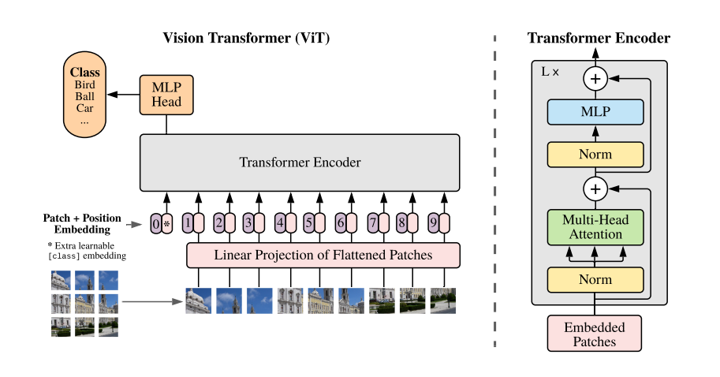
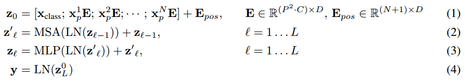
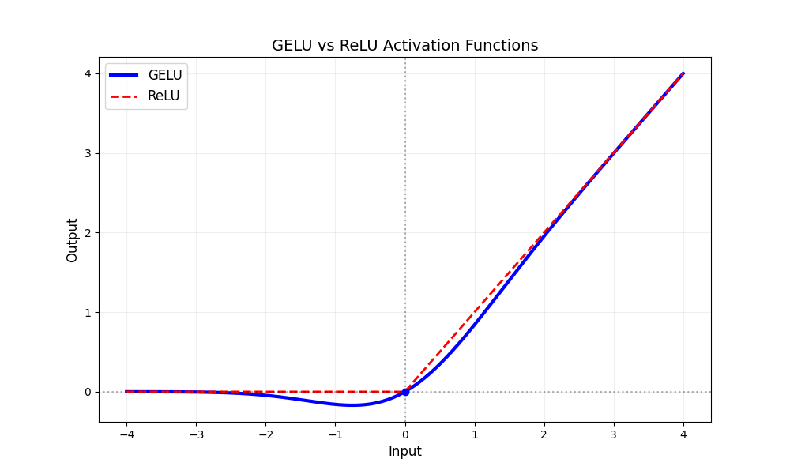
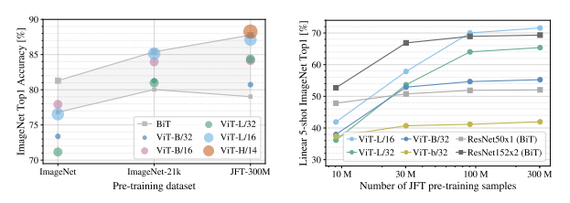

# VIT

论文链接：https://arxiv.org/pdf/2010.11929/1000

在计算机视觉领域，Vision Transformer (ViT) 是由谷歌团队于2020年提出的一个革命性研究成果，它成功挑战了自2012年AlexNet提出以来，卷积神经网络（CNN）在视觉任务中的主导地位

ViT 的核心创新在于将 Transformer 模型直接应用于图像处理任务，彻底打破了传统计算机视觉中依赖卷积神经网络的惯例

ViT的引入对计算机视觉与自然语言处理的融合起到了催化作用。越来越多的多模态任务开始采用Transformer架构作为共同的模型框架。例如，CLIP（Contrastive Language-Image Pretraining）和 Stable Diffusion 等模型，都在其设计中采用了预训练的ViT模型作为图像特征提取的核心组件

## 1 将 Transformer 应用于计算机视觉任务的挑战

Transformer 架构可以看之前的笔记文章，其中最关键的 注意力机制（Attention Mechanism）的核心操作是计算输入元素之间的注意力分数

在计算机视觉中，应用 Transformer 面临着几个挑战，主要包括：

### 1.1 注意力层的计算复杂度

Transformer 中的注意力层计算的是输入元素之间的相似度，并根据这些相似度计算加权平均。具体来说，注意力层需要计算一个注意力矩阵，矩阵中的每个元素表示两个输入元素之间的注意力分数

注意力分数的计算复杂度为 $O(n^2)$，其中 n 是输入序列的长度。这个计算复杂度对于较长的输入序列来说是非常高的

在计算机视觉任务中，输入的图像分辨率通常很高，例如常见的224×224像素的图像，如果将每个像素作为一个元素，那么输入序列的长度就为224 × 224 = 50176，这已经非常庞大，注意力矩阵的计算量极其巨大

对于更大的图像（例如目标检测任务中的416×416像素，甚至视频分类中的800×800像素），计算复杂度将成倍增加，导致直接应用 Transformer 的计算成本难以接受。因此，如何有效地将注意力机制应用于高维图像是将 Transformer 引入计算机视觉的关键问题

### 1.2 如何将二维图像转化为一维序列

Transformer 最适合处理序列数据，而图像是二维数据。为了将图像输入到 Transformer 中，需要先将图像从二维结构转换为一维序列。最直观的做法是将图像的每个像素视为输入序列的元素，然后将图像拉平成一个长向量

然而，直接将一个高分辨率图像（例如224×224像素）拉直成一个长度为50176的向量，显然计算开销巨大，无法在当前计算资源下高效处理

因此，ViT等模型采用了图像块（patch）的方式，将图像切分成多个较小的块（如16×16像素），然后将每个图像块当作一个元素输入到 Transformer 中。这样既能减小计算量，也能保持图像的空间结构信息。



### 1.3 如何与自注意力机制结合

如何将注意力机制应用于图像计算就是将 Transformer 应用于计算机视觉领域的重点。最简单的方式就是直接将 CNN 与自注意力机制结合，首先用 CNN 提取特征图（Feature Map），然后将特征图的每个位置视为序列的一个元素，接着应用自注意力机制

自注意力机制的计算过程可以总结为三个步骤，更详细的可以查看之前的笔记文章：

相似度计算：对于输入的每个元素（通常是特征图中的某个位置），使用点积、拼接或感知机等方式计算它与其他元素的相似度，得到一个注意力权重

标准化：通过softmax函数对计算出的注意力权重进行标准化，使得所有权重的和为1，从而得到规范化的注意力分数

加权平均：将注意力分数与对应的value（值向量）进行加权求和，得到最终的输出特征

这种自注意力机制的优势在于其全局性。通过查询（Query）和赋值（Value）操作，它可以捕获特征图中的全局空间信息，适用于处理需要全局上下文理解的任务。

结合原因与思路：

传统的 CNN 只能处理局部信息，因为卷积操作本质上是局部感受野的操作，模型只能关注到卷积核周围的局部区域，无法有效地融合远距离的特征。而自注意力机制能够通过加权融合的方式，处理全局信息，因此在需要全局上下文理解的任务中，表现优于传统 CNN

举个例子：在图像的某个位置（如图像中的一个球体）和图像的其他位置（如另一个球体）之间，存在空间上的远距离关系。自注意力机制能够通过计算注意力权重，将远处的信息加权融合到当前位置的特征表示中，从而提高模型对全局上下文的理解能力

## 2 基本架构与核心思想

ViT 的架构可以简要总结为以下几个主要步骤：

**图像分块 -> 扁平化和线性变换 -> 添加位置编码 -> Transformer 编码器 -> 图像分类**

通过这几个步骤，成功将 Transformer 模型应用于图像分类任务，简单介绍一下：


### 2.1 图像分块

ViT 首先将输入的图像切分为多个固定大小的图像块（patch）。例如，对于一张224x224的图像，若每个块的大小为16x16，那么图像将被切割成14x14=196个块。每个块可以视为一个“词”或者说是一个序列的元素

### 2.2 扁平化和线性变换

每个图像块被扁平化为一维向量，并通过一个线性投影（即一个全连接层）映射到一个固定维度的向量空间。这些变换后的向量将作为输入送入 Transformer 模型

### 2.3 添加位置编码

由于 Transformer 模型本身不具备感知输入顺序的能力，因此 ViT 为每个图像块添加了位置编码（Positional Encoding），以保留块在原图中的空间位置信息。位置编码通常采用类似于 NLP 任务中使用的编码方式

### 2.4 Transformer 编码器

经过位置编码处理后，图像块的向量进入标准的 Transformer 编码器架构中。Transformer 编码器主要由自注意力机制和前馈神经网络组成，通过多层堆叠的自注意力层来捕捉图像块之间的长程依赖关系

### 2.5 图像分类

Transformer 输出的特征向量经过一个池化层（通常是取平均或最大池化）后，送入一个全连接层进行最终的分类

我们可以看到和Transformer模型大体上一致，不同的是ViT先进行了层标准化然后才进行多头注意力或者多层感知机。

论文给出了Vision Transformer Encoder流程的公式：



其中Z0是刚才说的对图片预处理的到的Embedding，MSA代表多头注意力，MLP代表多层感知机，LN代表层标准化

-1750145054362-7.png)

#### GELU激活函数

**非线性**： GELU引入了非线性变换，使得神经网络能够学习更复杂的映射，有助于提高模型的表达能力。

**平滑性**： GELU是一个平滑的函数，具有连续的导数，没有梯度截断的问题，有助于梯度的稳定传播。并且GELU 在 0 附近比 ReLU 更加平滑，因此在训练过程中更容易收敛。

**防止神经元“死亡”**： 不同于ReLU在负数范围内完全置零，GELU在负数范围内引入了一个平滑的非线性，有助于防止神经元“死亡”问题。

**高斯分布**： GELU激活函数的输出在输入接近于 0 时接近于高斯分布，这有助于提高神经网络的泛化能力，使得模型更容易适应不同的数据分布。

**计算资源效率**： GELU激活函数的计算相对复杂，涉及到指数、平方根和双曲正切等运算，因此在计算资源有限的情况下可能会带来较大的计算开销。
**趋向于线性**：对于较大的输入值，GELU函数的输出趋向于线性，可能会导致一些非线性特征的丢失。

| 特性         | ReLU                                      | GELU                                     |
| ------------ | ----------------------------------------- | ---------------------------------------- |
| **梯度消失** | 在 $x<0$ 时梯度为 0，可能导致神经元“死亡” | 负数区域仍有微小梯度，缓解神经元死亡问题 |
| **计算效率** | 极高（只需比较和取最大值）                | 较高（需计算 $\text{erf}$ 或近似公式）   |
| **输出均值** | 通常为正（可能偏移分布）                  | 接近零均值（稳定网络训练）               |
| **平滑性**   | 非平滑（$x=0$ 处不可导）                  | 平滑（适合二阶优化方法）                 |

$$
\text{GELU}(x) = x \Phi(x) = x \cdot \frac{1}{2} \left[1 + \text{erf}\left(\frac{x}{\sqrt{2}}\right)\right]
$$



#####  为什么GELU适合Transformer？

1. **概率解释**：
   GELU 可以视为对神经元的随机开关（$x$ 越大，激活概率越高），与注意力机制的概率性质契合。
2. **梯度稳定**：
   平滑的负区处理避免了 ReLU 的梯度突变，适合深层 Transformer 的训练。
3. **零均值倾向**：
   输出接近零均值，减少层间输入分布的偏移（缓解协变量偏移问题）。

### 性能评估



#### **ResNet**

- **优势**：
  - **局部特征提取能力强**：ResNet通过卷积层能够很好地捕捉图像的局部纹理和边缘信息，对于一些依赖局部特征的任务（如目标检测）表现优异。
  - **训练稳定**：残差连接使得ResNet能够训练非常深的网络，而不会出现梯度消失或爆炸的问题。
  - **泛化能力较好**：在小规模数据集上，ResNet的泛化能力通常优于复杂的Transformer模型。
- **局限性**：
  - **难以捕捉全局依赖**：ResNet主要依赖局部卷积操作，对于需要全局上下文的任务（如图像分类中的一些复杂场景）表现可能不如ViT。
  - **模型复杂度较高**：随着网络深度的增加，ResNet的参数量也会显著增加，导致计算成本较高。

#### **ViT**

- **优势**：
  - **全局特征提取能力强**：ViT通过多头自注意力机制能够捕捉图像中的长距离依赖和全局特征，对于图像分类等任务表现优异。
  - **可扩展性强**：通过增加Transformer的层数或隐藏单元数量，可以很容易地扩展ViT的性能。
  - **预训练效果显著**：ViT在大规模数据集上进行预训练后，通过微调可以取得非常高的性能。
- **局限性**：
  - **过拟合风险高**：ViT的参数量大，模型复杂度高，在小规模数据集上容易过拟合。
  - **计算成本高**：Transformer的自注意力机制计算复杂度较高，尤其是对于高分辨率图像，计算成本会显著增加。
  - **对数据量需求大**：ViT需要大量的数据来训练，以避免过拟合并充分发挥其性能。


```python
"""
原始代码来自rwightman：
https://github.com/rwightman/pytorch-image-models/blob/master/timm/models/vision_transformer.py  
"""
from functools import partial
from collections import OrderedDict

import torch
import torch.nn as nn

def drop_path(x, drop_prob: float = 0., training: bool = False):
    """
    Drop paths (随机深度) 每个样本（当应用于残差块的主路径时）。
    这与我在EfficientNet等网络中创建的DropConnect实现相同，但原始名称具有误导性，因为“Drop Connect”是另一篇论文中的不同形式的dropout...
    参见讨论：https://github.com/tensorflow/tpu/issues/494#issuecomment-532968956   ... 我选择将层和参数名称改为“drop path”，而不是混合使用DropConnect作为层名称和“survival rate”作为参数。
    """
    if drop_prob == 0. or not training:
        return x
    keep_prob = 1 - drop_prob
    shape = (x.shape[0],) + (1,) * (x.ndim - 1)  # 适用于不同维度的张量，不仅仅是2D卷积网络
    random_tensor = keep_prob + torch.rand(shape, dtype=x.dtype, device=x.device)
    random_tensor.floor_()  # 二值化
    output = x.div(keep_prob) * random_tensor
    return output


class DropPath(nn.Module):
    """
    原论文中是使用dropout，但PyTorch官方使用DropPath。
    随机深度（Drop paths）每个样本（当应用于残差块的主路径时）。
    """
    def __init__(self, drop_prob=None):
        super(DropPath, self).__init__()
        self.drop_prob = drop_prob

def forward(self, x):
    return drop_path(x, self.drop_prob, self.training)


class PatchEmbed(nn.Module):
    """
    图像嵌入模块类
    将2D图像转换为Patch嵌入
    """
    def __init__(self, img_size=224, patch_size=16, in_c=3, embed_dim=768, norm_layer=None):
        """
        初始化函数
        参数：
            img_size (int): 输入图像的大小，默认为224
            patch_size (int): 每个patch的大小，默认为16
            in_c (int): 输入图像的通道数，默认为3（RGB图像）
            embed_dim (int): 嵌入维度，默认为768
            norm_layer (nn.Module): 可选的归一化层，默认为None
        """
        super().__init__()
        img_size = (img_size, img_size)  # 确保img_size是元组形式
        patch_size = (patch_size, patch_size)
        self.img_size = img_size  # 图像大小，例如(224, 224)
        self.patch_size = patch_size  # patch大小，例如(16, 16)
        self.grid_size = (img_size[0] // patch_size[0], img_size[1] // patch_size[1])  # 计算patch的数量，例如(14, 14)
        self.num_patches = self.grid_size[0] * self.grid_size[1]  # patch总数，例如196

    # 使用卷积层将图像分割成patch并嵌入到嵌入维度

    # 输入维度为3×224×224，输出维度为768×14×14

​    self.proj = nn.Conv2d(in_c, embed_dim, kernel_size=patch_size, stride=patch_size)
​    self.norm = norm_layer(embed_dim) if norm_layer else nn.Identity()  # 如果提供了归一化层，则使用；否则使用恒等映射

def forward(self, x):
    """
    前向传播
    参数：
        x (Tensor): 输入图像张量，形状为[B, C, H, W]
    返回：
        Tensor: 嵌入后的patch序列，形状为[B, num_patches, embed_dim]
    """
    B, C, H, W = x.shape  # 获取输入图像的批量大小、通道数、高度和宽度

    # 检查输入图像的大小是否与模型定义的大小一致

    assert H == self.img_size[0] and W == self.img_size[1], \
        f"输入图像大小 ({H}*{W}) 与模型定义的大小 ({self.img_size[0]}*{self.img_size[1]}) 不匹配。"

    # 使用卷积层将图像分割成patch并嵌入

    # 展平操作：[B, C, H, W] -> [B, C, HW]

    # 转置操作：[B, C, HW] -> [B, HW, C]

    x = self.proj(x).flatten(2).transpose(1, 2)
    x = self.norm(x)  # 应用归一化层（如果有）
    return x


class Attention(nn.Module):
    """
    多头自注意力机制模块
    """
    def __init__(self,
                 dim,  # 输入token的维度
                 num_heads=8,  # 多头注意力的头数
                 qkv_bias=False,  # 是否在生成QKV时使用偏置
                 qk_scale=None,  # 缩放因子
                 attn_drop_ratio=0.,  # 注意力dropout比率
                 proj_drop_ratio=0.):  # 投影dropout比率
        super(Attention, self).__init__()
        self.num_heads = num_heads
        head_dim = dim // num_heads  # 每个头的维度
        self.scale = qk_scale or head_dim ** -0.5  # 缩放因子，如果没有提供qk_scale，则使用默认值

    # 生成QKV的线性层

    self.qkv = nn.Linear(dim, dim * 3, bias=qkv_bias)
    self.attn_drop = nn.Dropout(attn_drop_ratio)
    self.proj = nn.Linear(dim, dim)  # 投影层
    self.proj_drop = nn.Dropout(proj_drop_ratio)

def forward(self, x):
    """
    前向传播
    参数：
        x (Tensor): 输入张量，形状为[B, num_patches + 1, embed_dim]
    返回：
        Tensor: 输出张量，形状为[B, num_patches + 1, embed_dim]
    """
    B, N, C = x.shape  # 获取批量大小、序列长度和嵌入维度

    # 生成QKV

    # qkv(): -> [B, N, 3 * C]

    # reshape: -> [B, N, 3, num_heads, C // num_heads]

    # permute: -> [3, B, num_heads, N, C // num_heads]

    qkv = self.qkv(x).reshape(B, N, 3, self.num_heads, C // self.num_heads).permute(2, 0, 3, 1, 4)
    q, k, v = qkv[0], qkv[1], qkv[2]  # 分别提取Q、K、V

    # 计算注意力分数

    # transpose: -> [B, num_heads, C // num_heads, N]

    # @: 矩阵乘法 -> [B, num_heads, N, N]

    attn = (q @ k.transpose(-2, -1)) * self.scale
    attn = attn.softmax(dim=-1)  # 应用Softmax函数
    attn = self.attn_drop(attn)  # 应用dropout

    # 计算加权求和

    # @: 矩阵乘法 -> [B, num_heads, N, C // num_heads]

    # transpose: -> [B, N, num_heads, C // num_heads]

    # reshape: -> [B, N, C]

    x = (attn @ v).transpose(1, 2).reshape(B, N, C)
    x = self.proj(x)  # 投影
    x = self.proj_drop(x)  # 应用dropout
    return x


class Mlp(nn.Module):
    """
    MLP模块，用于Vision Transformer、MLP-Mixer等网络
    """
    def __init__(self, in_features, hidden_features=None, out_features=None, act_layer=nn.GELU, drop=0.):
        """
        初始化函数
        参数：
            in_features (int): 输入特征维度
            hidden_features (int): 隐藏层特征维度，默认为输入特征维度的4倍
            out_features (int): 输出特征维度，默认为输入特征维度
            act_layer (nn.Module): 激活函数，默认为GELU
            drop (float): Dropout比率
        """
        super().__init__()
        out_features = out_features or in_features
        hidden_features = hidden_features or in_features
        self.fc1 = nn.Linear(in_features, hidden_features)
        self.act = act_layer()
        self.fc2 = nn.Linear(hidden_features, out_features)
        self.drop = nn.Dropout(drop)

def forward(self, x):
    """
    前向传播
    参数：
        x (Tensor): 输入张量
    返回：
        Tensor: 输出张量
    """
    x = self.fc1(x)
    x = self.act(x)
    x = self.drop(x)
    x = self.fc2(x)
    x = self.drop(x)
    return x


class Block(nn.Module):
    """
    Transformer编码器模块
    """
    def __init__(self,
                 dim,
                 num_heads,
                 mlp_ratio=4.,
                 qkv_bias=False,
                 qk_scale=None,
                 drop_ratio=0.,
                 attn_drop_ratio=0.,
                 drop_path_ratio=0.,
                 act_layer=nn.GELU,
                 norm_layer=nn.LayerNorm):
        """
        初始化函数
        参数：
            dim (int): 输入特征维度
            num_heads (int): 多头注意力的头数
            mlp_ratio (float): MLP隐藏层维度与输入特征维度的比例，默认为4
            qkv_bias (bool): 是否在生成QKV时使用偏置
            qk_scale (float): 缩放因子
            drop_ratio (float): Dropout比率
            attn_drop_ratio (float): 注意力dropout比率
            drop_path_ratio (float): 随机深度比率
            act_layer (nn.Module): 激活函数，默认为GELU
            norm_layer (nn.Module): 归一化层，默认为LayerNorm
        """
        super(Block, self).__init__()
        self.norm1 = norm_layer(dim)
        self.attn = Attention(dim, num_heads=num_heads, qkv_bias=qkv_bias, qk_scale=qk_scale,
                              attn_drop_ratio=attn_drop_ratio, proj_drop_ratio=drop_ratio)
        self.drop_path = DropPath(drop_path_ratio) if drop_path_ratio > 0. else nn.Identity()
        self.norm2 = norm_layer(dim)
        mlp_hidden_dim = int(dim * mlp_ratio)
        self.mlp = Mlp(in_features=dim, hidden_features=mlp_hidden_dim, act_layer=act_layer, drop=drop_ratio)

def forward(self, x):
    """
    前向传播
    参数：
        x (Tensor): 输入张量
    返回：
        Tensor: 输出张量
    """
    x = x + self.drop_path(self.attn(self.norm1(x)))  # 注意力模块 + 残差连接 + 随机深度
    x = x + self.drop_path(self.mlp(self.norm2(x)))  # MLP模块 + 残差连接 + 随机深度
    return x


class VisionTransformer(nn.Module):
    """
    Vision Transformer模型
    """
    def __init__(self, img_size=224, patch_size=16, in_c=3, num_classes=1000,
                 embed_dim=768, depth=12, num_heads=12, mlp_ratio=4.0, qkv_bias=True,
                 qk_scale=None, representation_size=None, distilled=False, drop_ratio=0.,
                 attn_drop_ratio=0., drop_path_ratio=0., embed_layer=PatchEmbed, norm_layer=None,
                 act_layer=None):
        """
        初始化函数
        参数：
            img_size (int): 输入图像的大小，默认为224
            patch_size (int): 每个patch的大小，默认为16
            in_c (int): 输入图像的通道数，默认为3
            num_classes (int): 分类类别数，默认为1000
            embed_dim (int): 嵌入维度，默认为768
            depth (int): Transformer的层数，默认为12
            num_heads (int): 多头注意力的头数，默认为12
            mlp_ratio (float): MLP隐藏层维度与输入特征维度的比例，默认为4
            qkv_bias (bool): 是否在生成QKV时使用偏置
            qk_scale (float): 缩放因子
            representation_size (int): 表示层的维度（如果启用）
            distilled (bool): 是否启用蒸馏（DeiT模型）
            drop_ratio (float): Dropout比率
            attn_drop_ratio (float): 注意力dropout比率
            drop_path_ratio (float): 随机深度比率
            embed_layer (nn.Module): 图像嵌入层，默认为PatchEmbed
            norm_layer (nn.Module): 归一化层，默认为LayerNorm
            act_layer (nn.Module): 激活函数，默认为GELU
        """
        super(VisionTransformer, self).__init__()
        self.num_classes = num_classes
        self.num_features = self.embed_dim = embed_dim  # 为了与其它模型保持一致性
        self.num_tokens = 2 if distilled else 1  # 如果启用蒸馏，则有两个token（class token和distillation token）
        norm_layer = norm_layer or partial(nn.LayerNorm, eps=1e-6)
        act_layer = act_layer or nn.GELU

    # 图像嵌入层

    self.patch_embed = embed_layer(img_size=img_size, patch_size=patch_size, in_c=in_c, embed_dim=embed_dim)
    num_patches = self.patch_embed.num_patches  # 获取patch的数量

    # 类别token和位置嵌入

    self.cls_token = nn.Parameter(torch.zeros(1, 1, embed_dim))
    self.dist_token = nn.Parameter(torch.zeros(1, 1, embed_dim)) if distilled else None
    self.pos_embed = nn.Parameter(torch.zeros(1, num_patches + self.num_tokens, embed_dim))
    self.pos_drop = nn.Dropout(p=drop_ratio)

    # Transformer编码器模块

    dpr = [x.item() for x in torch.linspace(0, drop_path_ratio, depth)]  # 随机深度衰减规则
    self.blocks = nn.Sequential(*[
        Block(dim=embed_dim, num_heads=num_heads, mlp_ratio=mlp_ratio, qkv_bias=qkv_bias, qk_scale=qk_scale,
              drop_ratio=drop_ratio, attn_drop_ratio=attn_drop_ratio, drop_path_ratio=dpr[i],
              norm_layer=norm_layer, act_layer=act_layer)
        for i in range(depth)
    ])
    self.norm = norm_layer(embed_dim)

    # 表示层（如果启用）

    if representation_size and not distilled:
        self.has_logits = True
        self.num_features = representation_size
        self.pre_logits = nn.Sequential(OrderedDict([
            ("fc", nn.Linear(embed_dim, representation_size)),
            ("act", nn.Tanh())
        ]))
    else:
        self.has_logits = False
        self.pre_logits = nn.Identity()

    # 分类器头部

    self.head = nn.Linear(self.num_features, num_classes) if num_classes > 0 else nn.Identity()
    self.head_dist = None
    if distilled:
        self.head_dist = nn.Linear(self.embed_dim, self.num_classes) if num_classes > 0 else nn.Identity()

    # 权重初始化

    nn.init.trunc_normal_(self.pos_embed, std=0.02)
    if self.dist_token is not None:
        nn.init.trunc_normal_(self.dist_token, std=0.02)
    nn.init.trunc_normal_(self.cls_token, std=0.02)
    self.apply(_init_vit_weights)

def forward_features(self, x):
    """
    提取特征
    参数：
        x (Tensor): 输入图像张量
    返回：
        Tensor: 提取的特征
    """

    # 将图像分割成patch并嵌入

    x = self.patch_embed(x)  # [B, num_patches, embed_dim]

    # 扩展类别token

    cls_token = self.cls_token.expand(x.shape[0], -1, -1)  # [B, 1, embed_dim]
    if self.dist_token is None:
        x = torch.cat((cls_token, x), dim=1)  # [B, num_patches + 1, embed_dim]
    else:
        x = torch.cat((cls_token, self.dist_token.expand(x.shape[0], -1, -1), x), dim=1)

    # 添加位置嵌入并应用dropout

    x = self.pos_drop(x + self.pos_embed)
    x = self.blocks(x)  # 通过Transformer编码器模块
    x = self.norm(x)
    if self.dist_token is None:
        return self.pre_logits(x[:, 0])  # 返回类别token的特征
    else:
        return x[:, 0], x[:, 1]  # 返回类别token和蒸馏token的特征

def forward(self, x):
    """
    前向传播
    参数：
        x (Tensor): 输入图像张量
    返回：
        Tensor: 输出张量
    """
    x = self.forward_features(x)
    if self.head_dist is not None:
        x, x_dist = self.head(x[0]), self.head_dist(x[1])
        if self.training and not torch.jit.is_scripting():

            # 在训练时返回两个分类器的预测结果

            return x, x_dist
        else:

            # 在推理时返回两个分类器的平均结果

            return (x + x_dist) / 2
    else:
        x = self.head(x)
    return x
```


