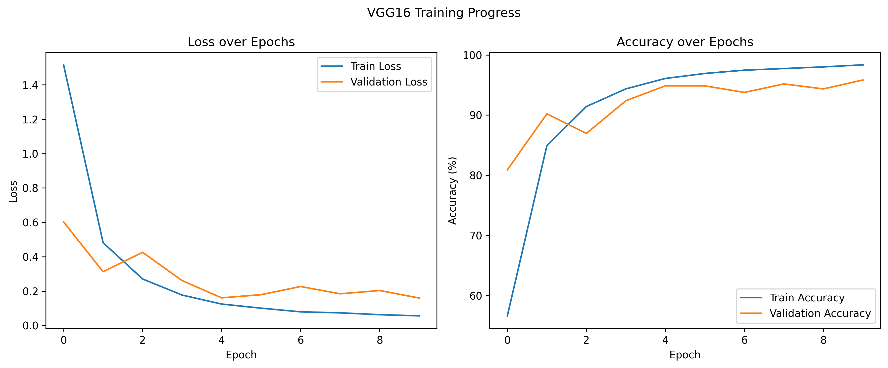
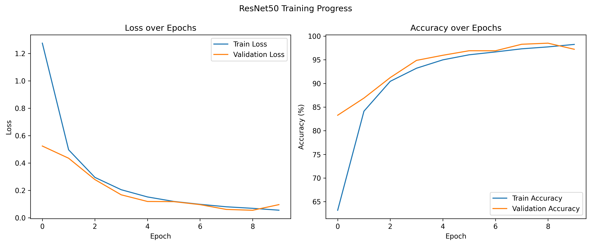
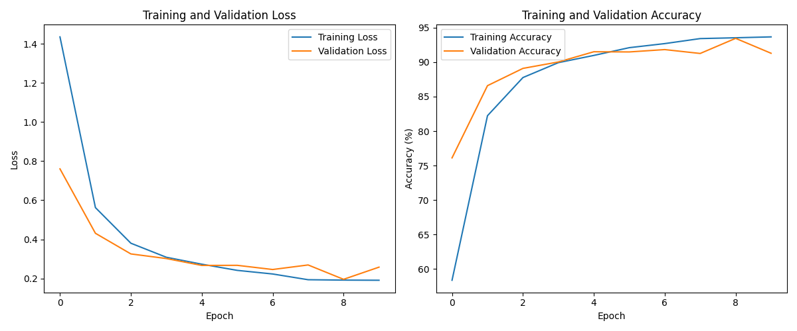
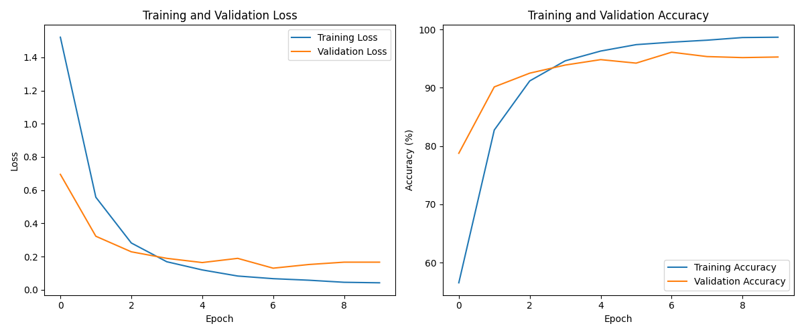
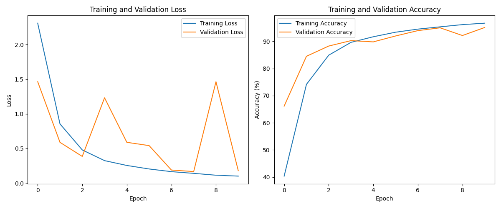

VGG16

```python
import torch
import torch.nn as nn
import torch.nn.functional as F


class VGG16(nn.Module):
    def __init__(self, num_classes=1000):
        super(VGG16, self).__init__()
        self.features = nn.Sequential(
            # Block 1
            nn.Conv2d(3, 64, kernel_size=3, padding=1),
            nn.ReLU(inplace=True),
            nn.Conv2d(64, 64, kernel_size=3, padding=1),
            nn.ReLU(inplace=True),
            nn.MaxPool2d(kernel_size=2, stride=2),

            # Block 2
            nn.Conv2d(64, 128, kernel_size=3, padding=1),
            nn.ReLU(inplace=True),
            nn.Conv2d(128, 128, kernel_size=3, padding=1),
            nn.ReLU(inplace=True),
            nn.MaxPool2d(kernel_size=2, stride=2),

            # Block 3
            nn.Conv2d(128, 256, kernel_size=3, padding=1),
            nn.ReLU(inplace=True),
            nn.Conv2d(256, 256, kernel_size=3, padding=1),
            nn.ReLU(inplace=True),
            nn.Conv2d(256, 256, kernel_size=3, padding=1),
            nn.ReLU(inplace=True),
            nn.MaxPool2d(kernel_size=2, stride=2),

            # Block 4
            nn.Conv2d(256, 512, kernel_size=3, padding=1),
            nn.ReLU(inplace=True),
            nn.Conv2d(512, 512, kernel_size=3, padding=1),
            nn.ReLU(inplace=True),
            nn.Conv2d(512, 512, kernel_size=3, padding=1),
            nn.ReLU(inplace=True),
            nn.MaxPool2d(kernel_size=2, stride=2),

            # Block 5
            nn.Conv2d(512, 512, kernel_size=3, padding=1),
            nn.ReLU(inplace=True),
            nn.Conv2d(512, 512, kernel_size=3, padding=1),
            nn.ReLU(inplace=True),
            nn.Conv2d(512, 512, kernel_size=3, padding=1),
            nn.ReLU(inplace=True),
            nn.MaxPool2d(kernel_size=2, stride=2),
        )

        self.avgpool = nn.AdaptiveAvgPool2d((7, 7))

        self.classifier = nn.Sequential(
            nn.Linear(512 * 7 * 7, 4096),
            nn.ReLU(inplace=True),
            nn.Dropout(),
            nn.Linear(4096, 4096),
            nn.ReLU(inplace=True),
            nn.Dropout(),
            nn.Linear(4096, num_classes),
        )

        # Initialize weights
        self._initialize_weights()

    def forward(self, x):
        x = self.features(x)
        x = self.avgpool(x)
        x = torch.flatten(x, 1)
        x = self.classifier(x)
        return x

    def _initialize_weights(self):
        for m in self.modules():
            if isinstance(m, nn.Conv2d):
                nn.init.kaiming_normal_(m.weight, mode='fan_out', nonlinearity='relu')
                if m.bias is not None:
                    nn.init.constant_(m.bias, 0)
            elif isinstance(m, nn.Linear):
                nn.init.normal_(m.weight, 0, 0.01)
                nn.init.constant_(m.bias, 0)
```

ResNet50

```python
import torch
import torch.nn as nn
import torch.nn.functional as F


class Bottleneck(nn.Module):
    expansion = 4  # 每个block最后的通道扩展倍数

    def __init__(self, in_channels, out_channels, stride=1, downsample=None):
        super(Bottleneck, self).__init__()
        self.conv1 = nn.Conv2d(in_channels, out_channels, kernel_size=1, bias=False)
        self.bn1 = nn.BatchNorm2d(out_channels)

        self.conv2 = nn.Conv2d(out_channels, out_channels, kernel_size=3,
                               stride=stride, padding=1, bias=False)
        self.bn2 = nn.BatchNorm2d(out_channels)

        self.conv3 = nn.Conv2d(out_channels, out_channels * self.expansion,
                               kernel_size=1, bias=False)
        self.bn3 = nn.BatchNorm2d(out_channels * self.expansion)

        self.relu = nn.ReLU(inplace=True)
        self.downsample = downsample
        self.stride = stride

    def forward(self, x):
        identity = x

        out = self.conv1(x)
        out = self.bn1(out)
        out = self.relu(out)

        out = self.conv2(out)
        out = self.bn2(out)
        out = self.relu(out)

        out = self.conv3(out)
        out = self.bn3(out)

        if self.downsample is not None:
            identity = self.downsample(x)

        out += identity
        out = self.relu(out)

        return out


class ResNet50(nn.Module):
    def __init__(self, block=Bottleneck, layers=[3, 4, 6, 3], num_classes=1000):
        super(ResNet50, self).__init__()
        self.in_channels = 64

        # 初始卷积层
        self.conv1 = nn.Conv2d(3, 64, kernel_size=7, stride=2, padding=3, bias=False)
        self.bn1 = nn.BatchNorm2d(64)
        self.relu = nn.ReLU(inplace=True)
        self.maxpool = nn.MaxPool2d(kernel_size=3, stride=2, padding=1)

        # 残差块层
        self.layer1 = self._make_layer(block, 64, layers[0], stride=1)
        self.layer2 = self._make_layer(block, 128, layers[1], stride=2)
        self.layer3 = self._make_layer(block, 256, layers[2], stride=2)
        self.layer4 = self._make_layer(block, 512, layers[3], stride=2)

        # 分类器
        self.avgpool = nn.AdaptiveAvgPool2d((1, 1))
        self.fc = nn.Linear(512 * block.expansion, num_classes)

        # 权重初始化
        for m in self.modules():
            if isinstance(m, nn.Conv2d):
                nn.init.kaiming_normal_(m.weight, mode='fan_out', nonlinearity='relu')
            elif isinstance(m, nn.BatchNorm2d):
                nn.init.constant_(m.weight, 1)
                nn.init.constant_(m.bias, 0)

    def _make_layer(self, block, out_channels, blocks, stride=1):
        downsample = None
        if stride != 1 or self.in_channels != out_channels * block.expansion:
            downsample = nn.Sequential(
                nn.Conv2d(self.in_channels, out_channels * block.expansion,
                          kernel_size=1, stride=stride, bias=False),
                nn.BatchNorm2d(out_channels * block.expansion),
            )

        layers = []
        layers.append(block(self.in_channels, out_channels, stride, downsample))
        self.in_channels = out_channels * block.expansion
        for _ in range(1, blocks):
            layers.append(block(self.in_channels, out_channels))

        return nn.Sequential(*layers)

    def forward(self, x):
        x = self.conv1(x)  # [B,3,224,224] -> [B,64,112,112]
        x = self.bn1(x)
        x = self.relu(x)
        x = self.maxpool(x)  # -> [B,64,56,56]

        x = self.layer1(x)  # -> [B,256,56,56]
        x = self.layer2(x)  # -> [B,512,28,28]
        x = self.layer3(x)  # -> [B,1024,14,14]
        x = self.layer4(x)  # -> [B,2048,7,7]

        x = self.avgpool(x)  # -> [B,2048,1,1]
        x = torch.flatten(x, 1)  # -> [B,2048]
        x = self.fc(x)  # -> [B,num_classes]

        return x
```


VIT

```python
"""
original code from rwightman:
https://github.com/rwightman/pytorch-image-models/blob/master/timm/models/vision_transformer.py
"""
from functools import partial
from collections import OrderedDict

import torch
import torch.nn as nn


def drop_path(x, drop_prob: float = 0., training: bool = False):
    """
    Drop paths (Stochastic Depth) per sample (when applied in main path of residual blocks).
    This is the same as the DropConnect impl I created for EfficientNet, etc networks, however,
    the original name is misleading as 'Drop Connect' is a different form of dropout in a separate paper...
    See discussion: https://github.com/tensorflow/tpu/issues/494#issuecomment-532968956 ... I've opted for
    changing the layer and argument names to 'drop path' rather than mix DropConnect as a layer name and use
    'survival rate' as the argument.
    """
    if drop_prob == 0. or not training:
        return x
    keep_prob = 1 - drop_prob
    shape = (x.shape[0],) + (1,) * (x.ndim - 1)  # work with diff dim tensors, not just 2D ConvNets
    random_tensor = keep_prob + torch.rand(shape, dtype=x.dtype, device=x.device)
    random_tensor.floor_()  # binarize
    output = x.div(keep_prob) * random_tensor
    return output


class DropPath(nn.Module):
    """
    原论文中是使用dropout，但是pytorch官方使用DropPath
    Drop paths (Stochastic Depth) per sample  (when applied in main path of residual blocks).
    """
    def __init__(self, drop_prob=None):
        super(DropPath, self).__init__()
        self.drop_prob = drop_prob

    def forward(self, x):
        return drop_path(x, self.drop_prob, self.training)


class PatchEmbed(nn.Module):  # 继承nn.Module
    """
    所有注释均采用VIT-base进行说明
    图像嵌入模块类
    2D Image to Patch Embedding
    """
    def __init__(self, img_size=224, patch_size=16, in_c=3, embed_dim=768, norm_layer=None):    # 初始化函数
        super().__init__()   # 继承父类的初始化方法
        img_size = (img_size, img_size)
        patch_size = (patch_size, patch_size)
        self.img_size = img_size  # 224*224
        self.patch_size = patch_size  # 16*16
        self.grid_size = (img_size[0] // patch_size[0], img_size[1] // patch_size[1])  # 224/16=14, 即14*14
        self.num_patches = self.grid_size[0] * self.grid_size[1]   # 14*14= 196个patch
        # 使用一个卷积层进行图像嵌入，输入维度为3*224*224，输出维度为768*14*14， 计算公式 size= (224-16+2*0)/16 + 1= 14
        self.proj = nn.Conv2d(in_c, embed_dim, kernel_size=patch_size, stride=patch_size)
        self.norm = norm_layer(embed_dim) if norm_layer else nn.Identity()   # 如果norm_layer为True，则使用，否则忽略

    def forward(self, x):
        B, C, H, W = x.shape  # 输入批量的图像
        # VIT模型对图像的输入尺寸有严格要求，故需要检查是否为224*224，如果不是则报错提示
        assert H == self.img_size[0] and W == self.img_size[1], \
            f"Input image size ({H}*{W}) doesn't match model ({self.img_size[0]}*{self.img_size[1]})."

        # flatten: [B, C, H, W] -> [B, C, HW]
        # transpose: [B, C, HW] -> [B, HW, C]
        # 将卷积嵌入后的图像特征图从第二个维度开始展平，得到BatchSize*768*196；然后转置1，2两个维度,得到BatchSize*196*768
        x = self.proj(x).flatten(2).transpose(1, 2)
        x = self.norm(x)   # norm_layer层规范化
        return x


class Attention(nn.Module):
    def __init__(self,
                 dim,   # 输入token的dim
                 num_heads=8,  # multiHead中 head的个数
                 qkv_bias=False,  # 决定生成Q,K,V时是否使用偏置
                 qk_scale=None,
                 attn_drop_ratio=0.,
                 proj_drop_ratio=0.):
        super(Attention, self).__init__()
        self.num_heads = num_heads
        head_dim = dim // num_heads   # 针对每个head，它的Q,K,V对应的维度；
        self.scale = qk_scale or head_dim ** -0.5   # 如果传入了qk_scale,则使用；否则，就是根号head_dim(就是d(k))分之一，及和原论文保持一致；
        self.qkv = nn.Linear(dim, dim * 3, bias=qkv_bias)  # 通过一个全连接层生成Q,K,V
        self.attn_drop = nn.Dropout(attn_drop_ratio)
        self.proj = nn.Linear(dim, dim)   # 通过一个全连接层实现将每一个头得到的注意力进行拼接
        self.proj_drop = nn.Dropout(proj_drop_ratio)

    def forward(self, x):
        # [batch_size, num_patches + 1, total_embed_dim]，其中，num_patches+1中的加1是为了保留class_token的位置
        B, N, C = x.shape   # [batch_size, 197, 768]

        # qkv(): -> [batch_size, num_patches + 1, 3 * total_embed_dim],生成Q,K,V
        # reshape: -> [batch_size, num_patches + 1, 3, num_heads, embed_dim_per_head],
        # permute: -> [3, batch_size, num_heads, num_patches + 1, embed_dim_per_head]
        qkv = self.qkv(x).reshape(B, N, 3, self.num_heads, C // self.num_heads).permute(2, 0, 3, 1, 4)
        # [batch_size, num_heads, num_patches + 1, embed_dim_per_head]
        q, k, v = qkv[0], qkv[1], qkv[2]  # make torchscript happy (cannot use tensor as tuple)

        # transpose: -> [batch_size, num_heads, embed_dim_per_head, num_patches + 1]
        # @: multiply -> [batch_size, num_heads, num_patches + 1, num_patches + 1]
        attn = (q @ k.transpose(-2, -1)) * self.scale
        attn = attn.softmax(dim=-1)
        attn = self.attn_drop(attn)

        # @: multiply -> [batch_size, num_heads, num_patches + 1, embed_dim_per_head]
        # transpose: -> [batch_size, num_patches + 1, num_heads, embed_dim_per_head]
        # reshape: -> [batch_size, num_patches + 1, total_embed_dim]
        x = (attn @ v).transpose(1, 2).reshape(B, N, C)
        x = self.proj(x)
        x = self.proj_drop(x)
        return x


class Mlp(nn.Module):
    """
    MLP as used in Vision Transformer, MLP-Mixer and related networks
    """
    def __init__(self, in_features, hidden_features=None, out_features=None, act_layer=nn.GELU, drop=0.):
        super().__init__()
        out_features = out_features or in_features
        hidden_features = hidden_features or in_features
        self.fc1 = nn.Linear(in_features, hidden_features)
        self.act = act_layer()
        self.fc2 = nn.Linear(hidden_features, out_features)
        self.drop = nn.Dropout(drop)

    def forward(self, x):
        x = self.fc1(x)
        x = self.act(x)
        x = self.drop(x)
        x = self.fc2(x)
        x = self.drop(x)
        return x


class Block(nn.Module):
    def __init__(self,
                 dim,
                 num_heads,
                 mlp_ratio=4.,
                 qkv_bias=False,
                 qk_scale=None,
                 drop_ratio=0.,
                 attn_drop_ratio=0.,
                 drop_path_ratio=0.,
                 act_layer=nn.GELU,
                 norm_layer=nn.LayerNorm):
        super(Block, self).__init__()
        self.norm1 = norm_layer(dim)
        self.attn = Attention(dim, num_heads=num_heads, qkv_bias=qkv_bias, qk_scale=qk_scale,
                              attn_drop_ratio=attn_drop_ratio, proj_drop_ratio=drop_ratio)
        # NOTE: drop path for stochastic depth, we shall see if this is better than dropout here
        self.drop_path = DropPath(drop_path_ratio) if drop_path_ratio > 0. else nn.Identity()
        self.norm2 = norm_layer(dim)
        mlp_hidden_dim = int(dim * mlp_ratio)
        self.mlp = Mlp(in_features=dim, hidden_features=mlp_hidden_dim, act_layer=act_layer, drop=drop_ratio)

    def forward(self, x):
        x = x + self.drop_path(self.attn(self.norm1(x)))
        x = x + self.drop_path(self.mlp(self.norm2(x)))
        return x


class VisionTransformer(nn.Module):
    def __init__(self, img_size=224, patch_size=16, in_c=3, num_classes=1000,
                 embed_dim=768, depth=12, num_heads=12, mlp_ratio=4.0, qkv_bias=True,
                 qk_scale=None, representation_size=None, distilled=False, drop_ratio=0.,
                 attn_drop_ratio=0., drop_path_ratio=0., embed_layer=PatchEmbed, norm_layer=None,
                 act_layer=None):
        """
        Args:
            img_size (int, tuple): input image size
            patch_size (int, tuple): patch size
            in_c (int): number of input channels
            num_classes (int): number of classes for classification head
            embed_dim (int): embedding dimension
            depth (int): depth of transformer
            num_heads (int): number of attention heads
            mlp_ratio (int): ratio of mlp hidden dim to embedding dim
            qkv_bias (bool): enable bias for qkv if True
            qk_scale (float): override default qk scale of head_dim ** -0.5 if set
            representation_size (Optional[int]): enable and set representation layer (pre-logits) to this value if set
            distilled (bool): model includes a distillation token and head as in DeiT models
            drop_ratio (float): dropout rate
            attn_drop_ratio (float): attention dropout rate
            drop_path_ratio (float): stochastic depth rate
            embed_layer (nn.Module): patch embedding layer
            norm_layer: (nn.Module): normalization layer
        """
        super(VisionTransformer, self).__init__()
        self.num_classes = num_classes
        self.num_features = self.embed_dim = embed_dim  # num_features for consistency with other models
        self.num_tokens = 2 if distilled else 1
        norm_layer = norm_layer or partial(nn.LayerNorm, eps=1e-6)
        act_layer = act_layer or nn.GELU

        self.patch_embed = embed_layer(img_size=img_size, patch_size=patch_size, in_c=in_c, embed_dim=embed_dim)
        num_patches = self.patch_embed.num_patches

        self.cls_token = nn.Parameter(torch.zeros(1, 1, embed_dim))
        self.dist_token = nn.Parameter(torch.zeros(1, 1, embed_dim)) if distilled else None
        self.pos_embed = nn.Parameter(torch.zeros(1, num_patches + self.num_tokens, embed_dim))
        self.pos_drop = nn.Dropout(p=drop_ratio)

        dpr = [x.item() for x in torch.linspace(0, drop_path_ratio, depth)]  # stochastic depth decay rule
        self.blocks = nn.Sequential(*[
            Block(dim=embed_dim, num_heads=num_heads, mlp_ratio=mlp_ratio, qkv_bias=qkv_bias, qk_scale=qk_scale,
                  drop_ratio=drop_ratio, attn_drop_ratio=attn_drop_ratio, drop_path_ratio=dpr[i],
                  norm_layer=norm_layer, act_layer=act_layer)
            for i in range(depth)
        ])
        self.norm = norm_layer(embed_dim)

        # Representation layer
        if representation_size and not distilled:
            self.has_logits = True
            self.num_features = representation_size
            self.pre_logits = nn.Sequential(OrderedDict([
                ("fc", nn.Linear(embed_dim, representation_size)),
                ("act", nn.Tanh())
            ]))
        else:
            self.has_logits = False
            self.pre_logits = nn.Identity()

        # Classifier head(s)
        self.head = nn.Linear(self.num_features, num_classes) if num_classes > 0 else nn.Identity()
        self.head_dist = None
        if distilled:
            self.head_dist = nn.Linear(self.embed_dim, self.num_classes) if num_classes > 0 else nn.Identity()

        # Weight init
        nn.init.trunc_normal_(self.pos_embed, std=0.02)
        if self.dist_token is not None:
            nn.init.trunc_normal_(self.dist_token, std=0.02)

        nn.init.trunc_normal_(self.cls_token, std=0.02)
        self.apply(_init_vit_weights)

    def forward_features(self, x):
        # [B, C, H, W] -> [B, num_patches, embed_dim]
        x = self.patch_embed(x)  # [B, 196, 768]
        # [1, 1, 768] -> [B, 1, 768]
        cls_token = self.cls_token.expand(x.shape[0], -1, -1)
        if self.dist_token is None:
            x = torch.cat((cls_token, x), dim=1)  # [B, 197, 768]
        else:
            x = torch.cat((cls_token, self.dist_token.expand(x.shape[0], -1, -1), x), dim=1)

        x = self.pos_drop(x + self.pos_embed)
        x = self.blocks(x)
        x = self.norm(x)
        if self.dist_token is None:
            return self.pre_logits(x[:, 0])
        else:
            return x[:, 0], x[:, 1]

    def forward(self, x):
        x = self.forward_features(x)
        if self.head_dist is not None:
            x, x_dist = self.head(x[0]), self.head_dist(x[1])
            if self.training and not torch.jit.is_scripting():
                # during inference, return the average of both classifier predictions
                return x, x_dist
            else:
                return (x + x_dist) / 2
        else:
            x = self.head(x)
        return x


def _init_vit_weights(m):
    """
    ViT weight initialization
    :param m: module
    """
    if isinstance(m, nn.Linear):
        nn.init.trunc_normal_(m.weight, std=.01)
        if m.bias is not None:
            nn.init.zeros_(m.bias)
    elif isinstance(m, nn.Conv2d):
        nn.init.kaiming_normal_(m.weight, mode="fan_out")
        if m.bias is not None:
            nn.init.zeros_(m.bias)
    elif isinstance(m, nn.LayerNorm):
        nn.init.zeros_(m.bias)
        nn.init.ones_(m.weight)


def vit_base_patch16_224(num_classes: int = 1000):
    """
    ViT-Base model (ViT-B/16) from original paper (https://arxiv.org/abs/2010.11929).
    ImageNet-1k weights @ 224x224, source https://github.com/google-research/vision_transformer.
    weights ported from official Google JAX impl:
    链接: https://pan.baidu.com/s/1zqb08naP0RPqqfSXfkB2EA  密码: eu9f
    """
    model = VisionTransformer(img_size=224,
                              patch_size=16,
                              embed_dim=768,
                              depth=12,
                              num_heads=12,
                              representation_size=None,
                              num_classes=num_classes)
    return model


def vit_base_patch16_224_in21k(num_classes: int = 21843, has_logits: bool = True):
    """
    ViT-Base model (ViT-B/16) from original paper (https://arxiv.org/abs/2010.11929).
    ImageNet-21k weights @ 224x224, source https://github.com/google-research/vision_transformer.
    weights ported from official Google JAX impl:
    https://github.com/rwightman/pytorch-image-models/releases/download/v0.1-vitjx/jx_vit_base_patch16_224_in21k-e5005f0a.pth
    """
    model = VisionTransformer(img_size=224,
                              patch_size=16,
                              embed_dim=768,
                              depth=12,
                              num_heads=12,
                              representation_size=768 if has_logits else None,
                              num_classes=num_classes)
    return model


def vit_base_patch32_224(num_classes: int = 1000):
    """
    ViT-Base model (ViT-B/32) from original paper (https://arxiv.org/abs/2010.11929).
    ImageNet-1k weights @ 224x224, source https://github.com/google-research/vision_transformer.
    weights ported from official Google JAX impl:
    链接: https://pan.baidu.com/s/1hCv0U8pQomwAtHBYc4hmZg  密码: s5hl
    """
    model = VisionTransformer(img_size=224,
                              patch_size=32,
                              embed_dim=768,
                              depth=12,
                              num_heads=12,
                              representation_size=None,
                              num_classes=num_classes)
    return model


def vit_base_patch32_224_in21k(num_classes: int = 21843, has_logits: bool = True):
    """
    ViT-Base model (ViT-B/32) from original paper (https://arxiv.org/abs/2010.11929).
    ImageNet-21k weights @ 224x224, source https://github.com/google-research/vision_transformer.
    weights ported from official Google JAX impl:
    https://github.com/rwightman/pytorch-image-models/releases/download/v0.1-vitjx/jx_vit_base_patch32_224_in21k-8db57226.pth
    """
    model = VisionTransformer(img_size=224,
                              patch_size=32,
                              embed_dim=768,
                              depth=12,
                              num_heads=12,
                              representation_size=768 if has_logits else None,
                              num_classes=num_classes)
    return model


def vit_large_patch16_224(num_classes: int = 1000):
    """
    ViT-Large model (ViT-L/16) from original paper (https://arxiv.org/abs/2010.11929).
    ImageNet-1k weights @ 224x224, source https://github.com/google-research/vision_transformer.
    weights ported from official Google JAX impl:
    链接: https://pan.baidu.com/s/1cxBgZJJ6qUWPSBNcE4TdRQ  密码: qqt8
    """
    model = VisionTransformer(img_size=224,
                              patch_size=16,
                              embed_dim=1024,
                              depth=24,
                              num_heads=16,
                              representation_size=None,
                              num_classes=num_classes)
    return model


def vit_large_patch16_224_in21k(num_classes: int = 21843, has_logits: bool = True):
    """
    ViT-Large model (ViT-L/16) from original paper (https://arxiv.org/abs/2010.11929).
    ImageNet-21k weights @ 224x224, source https://github.com/google-research/vision_transformer.
    weights ported from official Google JAX impl:
    https://github.com/rwightman/pytorch-image-models/releases/download/v0.1-vitjx/jx_vit_large_patch16_224_in21k-606da67d.pth
    """
    model = VisionTransformer(img_size=224,
                              patch_size=16,
                              embed_dim=1024,
                              depth=24,
                              num_heads=16,
                              representation_size=1024 if has_logits else None,
                              num_classes=num_classes)
    return model


def vit_large_patch32_224_in21k(num_classes: int = 21843, has_logits: bool = True):
    """
    ViT-Large model (ViT-L/32) from original paper (https://arxiv.org/abs/2010.11929).
    ImageNet-21k weights @ 224x224, source https://github.com/google-research/vision_transformer.
    weights ported from official Google JAX impl:
    https://github.com/rwightman/pytorch-image-models/releases/download/v0.1-vitjx/jx_vit_large_patch32_224_in21k-9046d2e7.pth
    """
    model = VisionTransformer(img_size=224,
                              patch_size=32,
                              embed_dim=1024,
                              depth=24,
                              num_heads=16,
                              representation_size=1024 if has_logits else None,
                              num_classes=num_classes)
    return model


def vit_huge_patch14_224_in21k(num_classes: int = 21843, has_logits: bool = True):
    """
    ViT-Huge model (ViT-H/14) from original paper (https://arxiv.org/abs/2010.11929).
    ImageNet-21k weights @ 224x224, source https://github.com/google-research/vision_transformer.
    NOTE: converted weights not currently available, too large for github release hosting.
    """
    model = VisionTransformer(img_size=224,
                              patch_size=14,
                              embed_dim=1280,
                              depth=32,
                              num_heads=16,
                              representation_size=1280 if has_logits else None,
                              num_classes=num_classes)
    return model
```


EfficientNet

```python
import torch
import torch.nn as nn
import torch.nn.functional as F
from math import ceil

# MBConv 模块（EfficientNet 核心块）
class MBConvBlock(nn.Module):
    def __init__(self, in_channels, out_channels, expansion=4, stride=1, kernel_size=3, se_ratio=0.25):
        super().__init__()
        expanded_channels = in_channels * expansion
        self.stride = stride
        self.use_residual = (in_channels == out_channels) and (stride == 1)

        # 扩展层（1x1 卷积）
        self.expand = nn.Sequential(
            nn.Conv2d(in_channels, expanded_channels, 1, bias=False),
            nn.BatchNorm2d(expanded_channels),
            nn.SiLU()  # Swish 激活
        ) if expansion != 1 else nn.Identity()

        # 深度可分离卷积
        self.dw_conv = nn.Sequential(
            nn.Conv2d(expanded_channels, expanded_channels, kernel_size,
                      stride=stride, padding=kernel_size//2, groups=expanded_channels, bias=False),
            nn.BatchNorm2d(expanded_channels),
            nn.SiLU()
        )

        # Squeeze-and-Excitation 模块
        se_channels = max(1, int(in_channels * se_ratio))
        self.se = nn.Sequential(
            nn.AdaptiveAvgPool2d(1),
            nn.Conv2d(expanded_channels, se_channels, 1),
            nn.SiLU(),
            nn.Conv2d(se_channels, expanded_channels, 1),
            nn.Sigmoid()
        )

        # 输出层（1x1 卷积）
        self.project = nn.Sequential(
            nn.Conv2d(expanded_channels, out_channels, 1, bias=False),
            nn.BatchNorm2d(out_channels)
        )

    def forward(self, x):
        residual = x
        x = self.expand(x)
        x = self.dw_conv(x)
        x = self.se(x) * x  # SE 模块
        x = self.project(x)
        if self.use_residual:
            x += residual
        return x

class EfficientNet(nn.Module):
    def __init__(self, num_classes=1000):
        super().__init__()
        # 初始卷积层
        self.stem = nn.Sequential(
            nn.Conv2d(3, 32, 3, stride=2, padding=1, bias=False),
            nn.BatchNorm2d(32),
            nn.SiLU()
        )

        # MBConv 块配置（B0 版本）
        mb_config = [
            # (expansion, out_channels, num_blocks, stride, kernel_size)
            (1, 16, 1, 1, 3),
            (6, 24, 2, 2, 3),
            (6, 40, 2, 2, 5),
            (6, 80, 3, 2, 3),
            (6, 112, 3, 1, 5),
            (6, 192, 4, 2, 5),
            (6, 320, 1, 1, 3)
        ]

        # 构建 MBConv 层
        layers = []
        in_channels = 32
        for expansion, out_channels, num_blocks, stride, kernel_size in mb_config:
            layers.append(MBConvBlock(in_channels, out_channels, expansion, stride, kernel_size))
            for _ in range(1, num_blocks):
                layers.append(MBConvBlock(out_channels, out_channels, expansion, 1, kernel_size))
            in_channels = out_channels
        self.blocks = nn.Sequential(*layers)

        # 分类头
        self.head = nn.Sequential(
            nn.Conv2d(in_channels, 1280, 1, bias=False),
            nn.BatchNorm2d(1280),
            nn.SiLU(),
            nn.AdaptiveAvgPool2d(1),
            nn.Flatten(),
            nn.Linear(1280, num_classes)
        )

    def forward(self, x):
        x = self.stem(x)
        x = self.blocks(x)
        x = self.head(x)
        return x
```


EfficientNet-V2

```python
import torch
import torch.nn as nn
import math
from typing import List, Callable


def _make_divisible(v: float, divisor: int, min_value: int = None) -> int:
    """
    Ensure that all layers have a channel number that's divisible by divisor.
    """
    if min_value is None:
        min_value = divisor
    new_v = max(min_value, int(v + divisor / 2) // divisor * divisor)
    if new_v < 0.9 * v:
        new_v += divisor
    return new_v


class SiLU(nn.Module):
    """Sigmoid-weighted Linear Unit (Swish) activation function."""

    def forward(self, x):
        return x * torch.sigmoid(x)


class SqueezeExcite(nn.Module):
    def __init__(self, in_channels: int, se_ratio: float = 0.25):
        super().__init__()
        reduced_channels = max(1, int(in_channels * se_ratio))
        self.se = nn.Sequential(
            nn.AdaptiveAvgPool2d(1),
            nn.Conv2d(in_channels, reduced_channels, 1),
            SiLU(),
            nn.Conv2d(reduced_channels, in_channels, 1),
            nn.Sigmoid()
        )

    def forward(self, x):
        return x * self.se(x)


class MBConvBlock(nn.Module):
    """Mobile Inverted Residual Bottleneck Block with squeeze-excitation."""

    def __init__(
            self,
            in_channels: int,
            out_channels: int,
            kernel_size: int,
            stride: int,
            expand_ratio: float,
            se_ratio: float,
            dropout_rate: float = 0.0,
    ):
        super().__init__()
        self.has_skip = stride == 1 and in_channels == out_channels

        expanded_channels = int(in_channels * expand_ratio)
        self.use_res_connect = self.has_skip

        layers = []

        # Expansion phase
        if expand_ratio != 1:
            layers.extend([
                nn.Conv2d(in_channels, expanded_channels, 1, bias=False),
                nn.BatchNorm2d(expanded_channels),
                SiLU()
            ])

        # Depthwise convolution
        layers.extend([
            nn.Conv2d(
                expanded_channels, expanded_channels, kernel_size, stride,
                padding=kernel_size // 2, groups=expanded_channels, bias=False
            ),
            nn.BatchNorm2d(expanded_channels),
            SiLU()
        ])

        # Squeeze and excitation
        if se_ratio is not None and se_ratio > 0:
            layers.append(SqueezeExcite(expanded_channels, se_ratio))

        # Output phase
        layers.extend([
            nn.Conv2d(expanded_channels, out_channels, 1, bias=False),
            nn.BatchNorm2d(out_channels)
        ])

        # Add dropout if specified
        if dropout_rate > 0:
            layers.append(nn.Dropout2d(dropout_rate))

        self.block = nn.Sequential(*layers)

    def forward(self, x):
        if self.use_res_connect:
            return x + self.block(x)
        return self.block(x)


class FusedMBConvBlock(nn.Module):
    """Fused MBConv block that combines expansion and depthwise convolution."""

    def __init__(
            self,
            in_channels: int,
            out_channels: int,
            kernel_size: int,
            stride: int,
            expand_ratio: float,
            se_ratio: float = None,
            dropout_rate: float = 0.0,
    ):
        super().__init__()
        self.has_skip = stride == 1 and in_channels == out_channels

        expanded_channels = int(in_channels * expand_ratio)
        self.use_res_connect = self.has_skip

        layers = []

        # Fused expansion + depthwise convolution
        if expand_ratio != 1:
            layers.extend([
                nn.Conv2d(in_channels, expanded_channels, kernel_size, stride,
                          padding=kernel_size // 2, bias=False),
                nn.BatchNorm2d(expanded_channels),
                SiLU()
            ])

        # Squeeze and excitation
        if se_ratio is not None and se_ratio > 0 and expand_ratio != 1:
            layers.append(SqueezeExcite(expanded_channels, se_ratio))

        # Projection if expanded
        if expand_ratio != 1:
            layers.extend([
                nn.Conv2d(expanded_channels, out_channels, 1, bias=False),
                nn.BatchNorm2d(out_channels)
            ])
        else:
            layers.extend([
                nn.Conv2d(in_channels, out_channels, kernel_size, stride,
                          padding=kernel_size // 2, bias=False),
                nn.BatchNorm2d(out_channels)
            ])

        # Add dropout if specified
        if dropout_rate > 0:
            layers.append(nn.Dropout2d(dropout_rate))

        self.block = nn.Sequential(*layers)

    def forward(self, x):
        if self.use_res_connect:
            return x + self.block(x)
        return self.block(x)


class EfficientNetV2(nn.Module):
    def __init__(
            self,
            width_mult: float = 1.0,
            depth_mult: float = 1.0,
            dropout_rate: float = 0.3,
            num_classes: int = 1000,
    ):
        super().__init__()

        # Configuration for EfficientNetV2-L
        # (type, kernel_size, stride, channels, expansion, layers, se_ratio)
        block_configs = [
            # Stage 0 (fused MBConv)
            ['fused_mbconv', 3, 1, 32, 1, 4, None],
            # Stage 1 (fused MBConv)
            ['fused_mbconv', 3, 2, 64, 4, 7, None],
            # Stage 2 (fused MBConv)
            ['fused_mbconv', 3, 2, 96, 4, 7, None],
            # Stage 3 (MBConv with SE)
            ['mbconv', 3, 2, 192, 4, 10, 0.25],
            # Stage 4 (MBConv with SE)
            ['mbconv', 3, 1, 224, 6, 19, 0.25],
            # Stage 5 (MBConv with SE)
            ['mbconv', 3, 2, 384, 6, 25, 0.25],
            # Stage 6 (MBConv with SE)
            ['mbconv', 3, 1, 640, 6, 7, 0.25],
        ]

        # Stem
        out_channels = _make_divisible(32 * width_mult, 8)
        self.stem = nn.Sequential(
            nn.Conv2d(3, out_channels, 3, stride=2, padding=1, bias=False),
            nn.BatchNorm2d(out_channels),
            SiLU()
        )

        # Build blocks
        blocks = []
        in_channels = out_channels

        for config in block_configs:
            block_type, kernel_size, stride, channels, expansion, layers, se_ratio = config
            out_channels = _make_divisible(channels * width_mult, 8)
            num_layers = int(math.ceil(layers * depth_mult))

            for i in range(num_layers):
                # Only first layer in each stage uses specified stride
                current_stride = stride if i == 0 else 1

                if block_type == 'fused_mbconv':
                    block = FusedMBConvBlock(
                        in_channels, out_channels, kernel_size, current_stride,
                        expansion, se_ratio, dropout_rate if i == num_layers - 1 else 0.0
                    )
                elif block_type == 'mbconv':
                    block = MBConvBlock(
                        in_channels, out_channels, kernel_size, current_stride,
                        expansion, se_ratio, dropout_rate if i == num_layers - 1 else 0.0
                    )
                else:
                    raise ValueError(f"Unknown block type: {block_type}")

                blocks.append(block)
                in_channels = out_channels

        self.blocks = nn.Sequential(*blocks)

        # Head
        last_channels = _make_divisible(1280 * max(1.0, width_mult), 8)
        self.head = nn.Sequential(
            nn.Conv2d(in_channels, last_channels, 1, bias=False),
            nn.BatchNorm2d(last_channels),
            SiLU(),
            nn.AdaptiveAvgPool2d(1),
            nn.Dropout(dropout_rate),
            nn.Flatten(),
            nn.Linear(last_channels, num_classes)
        )

        # Initialize weights
        self._initialize_weights()

    def forward(self, x):
        x = self.stem(x)
        x = self.blocks(x)
        x = self.head(x)
        return x
```

















| 模型         | VGG16  | ResNet50 | VIT    | EfficientNet | EfficientNet-V2 |
| ------------ | ------ | -------- | ------ | ------------ | --------------- |
| 验证集损失   | 0.1602 | 0.0560   | 0.1956 | 0.1300       | 0.1662          |
| 验证集准确率 | 95.80% | 98.47%   | 93.44% | 96.09%       | 95.00%          |


