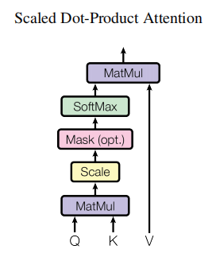
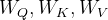

# transformer

论文链接：https://arxiv.org/abs/1706.03762

  Transformer 是一种用于处理序列数据的深度学习模型架构，最初由 Vaswani 等人在 2017 年的论文《Attention is All You Need》中提出。它彻底改变了自然语言处理（NLP）领域，成为许多高级任务（如机器翻译、文本生成、问答系统等）的基础架构。Transformer 的核心思想是自注意力机制（Self-Attention），而不依赖于传统的 RNN 或 CNN，在机器翻译上效果特别好，横扫NLP领域。

## 1. Transformer整体结构

Transformer在数据角度上理解，和RNN是一致的，也和CNN是一致的。Transformer和RNN都保留了编码和解码的结构，这是什么原因呢？Transformer翻译过来叫做“变形金刚”，而编码-解码的过程，也如同变形金刚一样，先拆解为流体一般的变形元素，再变回机器人。Transformer 的结构复杂，分为编码和解码两个过程，每个encoder和decoder都是串联结构，其中编码器将输入序列编码成一个固定维度的表示，而解码器根据这个表示生成输出序列。注意力机制相当于是拆解对照表，计算各个零部件的权重，标明互相间的关系，而前馈网络就是根据权重变一次形状；在decoder还多了一层encoder-decoder attention，组装的时候不仅要考虑自己还要考虑拆解信息。数据如何在这些模块流动？首先，用算法把单词向量化，输入向量先嵌入位置信息，self attention是零件自查表，用softmax函数过滤掉不相关的单词，经过一系列矩阵操作，实现了单词计算，并消除Q,K,V初始值的影响，如下图所示：


 将Encoder和Decoder拆开，可以看到完整的结构，如下图所示： 


### Transformer的优势和缺点

##### 优势

并行计算能力。Transformer并行计算的能力是远远超过seq2seq系列的模型。

表征能力。Transformer让源序列和目标序列“自关联”起来，源序列和目标序列自身的embedding所蕴含的信息更加丰富，而且后续的FFN（前馈神经网络）层也增强了模型的表达能力。

特征提取能力。Transformer论文提出深度学习既MLP、CNN、RNN后的第4大特征提取器。Transformer具有全局视野，其特征提取能力比RNN系列的模型要好。具体实验对比可以参考：放弃幻想，全面拥抱Transformer：自然语言处理三大特征抽取器（CNN/RNN/TF）比较。

语义结构。Transformer擅长捕捉文本和图像中的语义结构，它们比其他技术更好地捕捉文本甚至图像中的语义结构。Transformer的泛化能力和Diffusion Model（扩散模型）的细节保持能力的结合，提供了一种生成细粒度的高度详细图像的能力，同时保留图像中的语义结构。

泛化能力。在视觉应用中，Transformer表现出泛化和自适应的优势，使其适合通用学习。

##### 缺点

第一，计算量大，对硬件要求高，在许多视觉领域也面临着性能方面的问题。

第二，因为无归纳偏置，需要大量的数据才可以取得很好的效果。

## 2. 词嵌入

### 2.1编解码      

```
 对于机器翻译来说，我们只能针对中文和英文这种纯文本来完成语义的对应，语言的可能性是无穷的，表达的语义也是无法穷尽，所以我们只能通过大量文本的上下文来确定词和词之间的关系。那编码和解码中的“码”到底是什么呢？其实就是把各种语言里面那些符号发音等等形式上的不同剥离掉之后，剩下来的单纯的语言关系。首先，因为需要用计算机来处理，这个语义关系应该是数字化的；其次，它需要表示语义之间的关系，所以这个语义关系码数字化后的数值要能体现出语义之间的关系来才行。假如，我们用高维空间里面的坐标来当作数字化码之后的结果，香蕉🍌对应的点和猴子🐒对应的点距离应该比较近，因为他们的语义比较近。那高维空间里面的码如何得到呢？
```
对文本里面的最基础的语义单元进行数字化有两种，tokenizer（分词器，标记器）和one hot（独热编码）。标记器和独热编码实际上就是采用不同的策略对TOKEN实施数字化：

**tokenizer**：数字化的方式比较简单，就是给不同的token分配一个独立的id，就相当于是把所有的token都投射到了一根一维的数轴上。标记器是把所有token都投射到了一个一维空间。
**独热编码**：它做的事情就是把二进制的每一位对应一个token。独热编码则是为每一个token都分配了一个单独的维度，最后就变成了有多少token，就有多少维度的高维空间。

 对于分词器来说，把所有的token都投射到了一根一维的数轴上，空间比较密集，就很难表达出一些复杂的语义；而独热编码空间太过稀疏了，很容易能表现出组合语义，但很难体现出token与token之间的联系（token之间互相正交，内积均为0，且均分布在距离原点为1的高维球面上）。

综合上述两种极端编码情况，我们就可以找到一个维度高但是没那么高的空间，也就是我们所说的潜空间。如何找到这样的潜空间呢？可以基于分词后的ID去升维，也可以基于独热编码去降维。降维相当于是将数据进行压缩，而升维相当于是将压缩后的数据进行还原，降维从直觉上去想相对简单一些。而降维其实是一种空间变换，也就是在线性代数里面就是矩阵与向量相乘。


### 2.2Word2Vec

编码就是先把一个文本里的TOKEN都先编成独热码，然后再进行降维。这个过程就相当于是把输入的一句话，根据语义投射到潜空间中，把高维空间里的对象，投射到低维空间，这个过程叫做Embedding。因为是采用矩阵乘法这种方式实现嵌入的，所以把TOKEN投射到潜空间里的那个矩阵就被称作嵌入矩阵。比如，中文和英语完全可以用两套不一样的词汇表，然后分别嵌入到两个独立的潜空间中，然后采用某些算法，把这两个潜空间融合起来；也可以把中文和英文放到一个大的词汇表训练，得到一个大的潜空间。 

一个句子经过编码后得到token，然后token经过解码后变成另一个句子，这两个句子应该是一样的。但是，训练应该是经过模型之后计算出来一个结果，这个结果和正确答案是有差异的，然后才能把这个差异去反向传播回去，去修正参数。而这种情况是没有办法进行训练的，因为不论输入的向量是什么，只要前面和后面的矩阵是伪逆关系，那输入输出结果一定是相等的。

如果有五个词向量，把中间一个扣掉，将剩下四个向量相加之后训练出来的是中间扣掉的向量。Word2Vec更像是编词典，不需要激活函数，训练之后体现的是单个TOKEN之间的联系，在生成的潜空间，用其他的词向量去合成目标词向量。


 Word2Vec结构如下，不存在激活函数，仅有一层隐藏层。


### 2.3Embedding layer

Transformer 的输入并非简单的one-hot vectore，原因包括这种表达方式的结果非常稀疏，非常大，且不能表达 word 与 word 之间的特征。所以这里对词进行 embedding，用较短的向量表达这个 word 的属性。一般在 Pytorch 中，我们都是用 nn.Embedding 来做，或者直接用 one-hot vector 与权重矩阵 W 相乘得到。

nn.Embedding 包含一个权重矩阵 W，对应的 shape 为 ( num_embeddings，embedding_dim )。num_embeddings 指的是词汇量，即想要翻译的 vocabulary 的长度，embedding_dim 指的是想用多长的 vector 来表达一个词，可以任意选择，比如64，128，256，512等。在 Transformer 论文中选择的是512(即 d_model =512)。其实可以形象地将 nn.Embedding 理解成一个 lookup table，里面对每一个 word 都存了向量 vector 。给任意一个 word，都可以从表中查出对应的结果。处理 nn.Embedding 权重矩阵有两种选择：

（1）使用 pre-trained 的 embeddings 并固化，这种情况下实际就是一个 lookup table。
（2）对其进行随机初始化(当然也可以选择 pre-trained 的结果)，但设为 trainable。这样在 training 过程中不断地对 embeddings 进行改进。（嵌入矩阵需要在训练中调整参数）

在 Annotated Transformer 中，class “Embeddings“ 用来生成 word 的embeddings，其中用到 nn.Embedding。具体实现见下：

```python
class Embeddings(nn.Module):
    def __init__(self, d_model, vocab):
        super(Embeddings, self).__init__()
        self.lut = nn.Embedding(vocab, d_model)
        self.d_model = d_model

    def forward(self, x):
        return self.lut(x) * math.sqrt(self.d_model)
```

## 3. 注意力机制

### 3.1自注意力Self-Attention

对词和词组合后的语义进行理解，靠的就是注意力机制。词嵌入已经解决了单个词单个TOKEN语义的问题，注意力机制要解决的是许多词组合之后整体的语义，这组词向量就组成了数据矩阵。经过注意力机制之后，输入的词向量矩阵都需要经过矩阵相乘之后得到Q, K, V。



注意力机制的公式表示如下：
$$
\mathrm{Attention}(Q,K,V)=\mathrm{softmax}(\frac{QK^T}{\sqrt{d_k}})V
$$
这里我们介绍一下这个公式，假设输入有一个序列![X=[x_{1},x_{2},...,x_{n}]](transformer.assets/eqX%3D[x_{1}%2Cx_{2}%2C...png)，其中为是输入的第 i 个元素，维度为 d ，那么对于 Self-Attention，关键的公式如下：

**计算Query、Key和Value输入**

通过线性变换分别得到**Query**(Q)、**Key**(K)和**Value**(V)：
$$
Q=XW_{Q}
$$

$$
K=XW_{K}
$$

$$
V=XW_{V}
$$

其中分别是训练的权重矩阵。

**计算注意力分数（Attention Scores）**

利用 **Query** 和 **Key** 计算注意力分数。注意力分数是 **Query** 和 **Key** 的点积，然后经过缩放处理(除以，其中是 Key 向量的维度)
$$
Attention\:Scores=\frac{QK^{T}}{\sqrt{d_{k}}}
$$
这个分数反映了序列中每一对元素之间的相似度。接下来，我们对这些分数进行归一化处理（通过 Softmax 函数）：
$$
AttentionWeights=Softmax(\frac{QK^{T}}{\sqrt{d_{k}}})
$$
这个步骤确保了所有注意力权重的和为 1，使得它们可以作为概率分布。

- **计算加权和（Weighted Sum）**

将注意力权重与 Value 进行加权平均，得到最终的输出：
$$
Attention Output = Attention Weights × V
$$
这一步的输出是一个新的表示，它是所有输入位置的加权求和结果，权重由其与 **Query** 的相关性决定。

以上为公式的原理，现在我举一个实际的例子来帮助大家理解这一部分。假设我们有一个长度为 3 的输入序列，每个元素是一个 2 维的嵌入：


其中，X 是一个形状为 (3,2) 的矩阵，表示每个位置的 2 维特征。为了计算 **Query**（Q）、**Key**（K）和 **Value**（V），我们首先需要通过一组权重矩阵对输入进行线性变换。假设权重矩阵如下（为简单起见，设定为 2 x 2 矩阵）:


这些矩阵分别用于计算 **Query**、**Key** 和 **Value**。

根据上面的公式可得到：


得到 **Query** 和 **Key** 后，我们可以计算注意力分数。具体来说，对于每个 **Query**，我们与所有 **Key** 进行点积运算。计算如下：


注意，我们在这里计算的是 Query 和 Key 的点积，然后将其结果进行缩放。缩放因子通常是，其中是 Key 向量的维度。在这个例子中，Key 的维度是 2，所以缩放因子是 。


然后，我们对每行的 **Scaled Attention Scores** 应用 softmax 操作，得到注意力权重：


最后，使用注意力权重对 **Value**（V）进行加权求和：


### 3.2交叉注意力

decoder与encoder相比，在注意力结束之后，还会进行一个交叉注意力机制，解码器里的每一层都会拿到编码器的结果进行参考。Transformer在训练过程中，解码部分和编码部分是可以并行进行训练的，最终可以得到编码器部分和解码器部分潜空间中的词向量，损失函数是两个词向量的差异，然后进行反向传播。

​    而在Transformer的推理过程中，考虑到在机器翻译的过程中，token的数量并非是一一对应的，相同的语义token的数量并不一样。输入一句中文进行翻译，得到的英文结果需要一个一个地去生成，这个过程就用到了RNN的思路。编码器部分需要将一句话全部输入，得到潜空间中的词向量，在解码器部分也是需要输入内容的，这时候我们输入“开始符号”——<BOS>，输入这个符号之后，经过交叉注意力进行计算之后，最后会得到一个结果，这个结果进行升维和softmax计算之后，会得到词汇表中的某个词，重复这个过程，直到收到结束符号之后，整个翻译过程结束。


### 3.3多头注意力 Multi-Head Attention

在多头注意力机制中，模型会并行地计算多个不同的注意力头，每个头都有自己独立的 Query、Key 和 Value 权重，然后将每个头的输出连接起来，并通过一个线性变换得到最终的结果。

原文公式如下：
$$
\mathrm{MultiHead}(Q,K,V)=\mathrm{Concat}(\mathrm{head}_1,...,\mathrm{head}_\mathrm{h})W^O
$$

$$
where head_{i}= Attention( QW_{i}^{Q}, KW_{i}^{K}, VW_{i}^{V})
$$


##### 分割 Query、Key 和 Value 成多个头

对于每个头i，分别计算独立的 Query、Key 和 Value：

$$
Q_{i}=XW_{Q_{i}} \qquad K_{i}=XW_{K_{i}}\qquad V_{i}=XW_{V_{i}}
$$

##### 计算每个头的注意力输出

$$
Attention\; Output_{i} =Softmax(\frac{Q_{i}K_{i}^{T}}{\sqrt{d_{k}}})\times V_{i}
$$

##### 拼接各头的输出

将所有头的输出拼接在一起，h 是头的数量

$$
Multi-Head Output=Concat(Attention\;Output_{1}, Attention\;Output_{2},...,Attention\;Output_{h})
$$

##### 最终输出

对拼接后的结果进行一次线性变换，得到最终的多头注意力输出。

这里我们不再举例了，下面你可以根据下面的代码进行测试。

```python
import torch
import torch.nn as nn
import torch.nn.functional as F

class MultiHeadAttention(nn.Module):
    def __init__(self, embed_dim, num_heads):
        """
        初始化 MultiHeadAttention 模块
        :param embed_dim: 输入嵌入的特征维度
        :param num_heads: 注意力头的数量
        """
        super(MultiHeadAttention, self).__init__()
        assert embed_dim % num_heads == 0, "embed_dim 必须能被 num_heads 整除"

        self.embed_dim = embed_dim
        self.num_heads = num_heads
        self.head_dim = embed_dim // num_heads  # 每个头的特征维度
     
        # 定义 Query, Key 和 Value 的线性变换
        self.q_linear = nn.Linear(embed_dim, embed_dim)
        self.k_linear = nn.Linear(embed_dim, embed_dim)
        self.v_linear = nn.Linear(embed_dim, embed_dim)
     
        # 输出的线性变换
        self.out_linear = nn.Linear(embed_dim, embed_dim)
     
    def forward(self, x):
        """
        :param x: 输入张量，形状为 (batch_size, seq_len, embed_dim)
        :return: 注意力后的输出，形状为 (batch_size, seq_len, embed_dim)
        """
        batch_size, seq_len, embed_dim = x.size()
        # 生成 Query, Key, Value (batch_size, seq_len, embed_dim)
        Q = self.q_linear(x)
        K = self.k_linear(x)
        V = self.v_linear(x)
     
        # 分成多头 (batch_size, num_heads, seq_len, head_dim)
        Q = Q.view(batch_size, seq_len, self.num_heads, self.head_dim).transpose(1, 2)
        K = K.view(batch_size, seq_len, self.num_heads, self.head_dim).transpose(1, 2)
        V = V.view(batch_size, seq_len, self.num_heads, self.head_dim).transpose(1, 2)
        # 计算注意力分数 (batch_size, num_heads, seq_len, seq_len)
        attention_scores = torch.matmul(Q, K.transpose(-2, -1)) / torch.sqrt(
            torch.tensor(self.head_dim, dtype=torch.float32))
        attention_weights = F.softmax(attention_scores, dim=-1)
        # 加权求和 (batch_size, num_heads, seq_len, head_dim)
        attention_output = torch.matmul(attention_weights, V)
        # 拼接多头输出 (batch_size, seq_len, embed_dim
        attention_output = attention_output.transpose(1, 2).contiguous().view(batch_size, seq_len, embed_dim)
        # 输出线性变换 (batch_size, seq_len, embed_dim)
        output = self.out_linear(attention_output)
        return output

class SelfAttention(MultiHeadAttention):
    def __init__(self, embed_dim):
        """
        初始化 SelfAttention 模块
        :param embed_dim: 输入嵌入的特征维度
        """
        super(SelfAttention, self).__init__(embed_dim, num_heads=1)

    def forward(self, x):
        """
        :param x: 输入张量，形状为 (batch_size, seq_len, embed_dim)
        :return: 注意力后的输出，形状为 (batch_size, seq_len, embed_dim)
        """
        return super(SelfAttention, self).forward(x)

if __name__ == "__main__":
    embed_dim = 64  # 输入特征维度
    num_heads = 8  # 注意力头的数量
    model = SelfAttention(embed_dim)
    multi_model = MultiHeadAttention(embed_dim, num_heads)
    batch_size = 2
    seq_len = 10
    x = torch.rand(batch_size, seq_len, embed_dim)
    output = model(x)
    output2 = multi_model(x)
    print("输出形状:", output.shape)  # 应为 (batch_size, seq_len, embed_dim)
    print("输出形状:", output2.shape)
```

### 4.位置编码（Positional Encoding）       

由于 Transformer 模型并不具备像 RNN 或 CNN 那样的顺序性，没有内置的序列位置信息，它需要额外的位置编码来表达输入序列中单词的位置顺序，通过将一组固定的编码添加到输入的嵌入向量中，表示输入的相对或绝对位置。

那 RNN 为什么在任何地方都可以对同一个 word 使用同样的向量呢？因为 RNN 是按顺序对句子进行处理的，一次一个 word。但是在 Transformer 中，输入句子的所有 word 是同时处理的，没有考虑词的排序和位置信息。Transformer 加入 “positional encoding” 来解决这个问题，使得 Transformer 可以衡量 word 位置有关的信息。positional encoding 与 word embedding 相加就得到 embedding with position。如果是乘法的话，位置对词向量的影响就太大。

那么具体 ”positional encoding“ 怎么做？为什么能表达位置信息呢？作者探索了两种创建 positional encoding 的方法：

（1）通过训练学习 positional encoding 向量
（2）使用公式来计算 positional encoding向量

试验后发现两种选择的结果是相似的，所以采用了第2种方法，优点是不需要训练参数，而且即使在训练集中没有出现过的句子长度上也能用。计算 positional encoding 的公式为：
$$
PE_{(pos,2i)}=sin(pos/10000^{2i/d_{\mathrm{model}}})
$$

$$
PE_{(pos,2i+1)}=cos(pos/10000^{2i/d_{\mathrm{model}}})
$$

 其中，pos 指的是这个 word 在这个句子中的位置 ，i指的是 embedding 维度。比如选择 d_model=512，那么i就从1数到512 。

### Pytorch代码

```python
import torch
import torch.nn as nn
import torch.nn.functional as F
import math

class PostionalEncoder(nn.Module):
    """
    位置编码层，为输入序列添加位置信息
    公式: PE(pos,2i) = sin(pos/10000^(2i/d_model))
    PE(pos,2i+1) = cos(pos/10000^(2i/d_model))
    """
    def __init__(self,d_model, dropout=0.1, max_len=5000):
        super(PostionalEncoder,self).__init__()
        self.dropout = nn.Dropout(p=dropout)

        #计算位置编码PE
        PE=torch.zeros(max_len,d_model)
        #计算词向量位置pos
        postion=torch.arange(0,max_len,dtype=float).unsqueeze(1)
        #分母用换底公式变换后表示
        div_term=torch.exp(torch.arange(0, d_model, 2) * -(math.log(10000.0) / d_model))

        PE[:,0::2]=torch.sin(postion/div_term)#偶数位用sin表示
        PE[:,1::2]=torch.cos(postion/div_term)#奇数位用cos表示
        #变换形状为[max_len,1,d_model]
        PE=PE.unsqueeze(0).transpose(0,1)
        self.register_buffer('PE', PE)  # 注册为缓冲区，不参与训练

    def forward(self,x):
        """
        参数:
            x: 输入张量，形状为 [seq_len, batch_size, embedding_dim]
        返回:
            添加了位置编码的张量
        """
        x = x + self.PE[:x.size(0), :]  # 只取前x.size(0)个位置编码
        return self.dropout(x)

class MultiHeadAttention(nn.Module):
    """
    初始化 MultiHeadAttention 模块
    :param d_model: 输入嵌入的特征维度
    :param n_head: 注意力头的数量
    """
    def __init__(self,d_model,n_head,dropout=0.1):
        super(MultiHeadAttention,self).__init__()
        assert d_model%n_head==0,"d_model必须能被n_head整除"

        self.d_model=d_model# 模型维度
        self.n_head=n_head# 注意力头数量
        self.d_k=d_model//n_head# 每个头的维度

        #线性变换矩阵
        self.Wq=nn.Linear(d_model,d_model)#查询矩阵
        self.Wk=nn.Linear(d_model,d_model)#键矩阵
        self.Wv=nn.Linear(d_model,d_model)#值矩阵

        #输出层
        self.out=nn.Linear(d_model,d_model)
        self.dropout = nn.Dropout(p=dropout)

        #缩放因子，即公式中根号dk
        self.scale=torch.sqrt(torch.FloatTensor([d_model])).to(device)

    def forward(self,query,key,value,mask=None):
        """
        参数:
            query: 查询张量 [batch_size, q_len, d_model]
            key: 键张量 [batch_size, k_len, d_model]
            value: 值张量 [batch_size, v_len, d_model]
            mask: 掩码张量 [batch_size, 1, 1, k_len] (decoder用) 或 [batch_size, 1, k_len, k_len] (encoder用)
        返回:
            注意力输出 [batch_size, q_len, d_model]
            注意力权重 [batch_size, n_head, q_len, k_len]
        """
        batch_size = query.size(0)
        #1. 线性投影+分头
        # [batch_size, n_head, q_len, d_k]
        Q=self.Wq(query).view(batch_size,-1,self.n_head,self.d_k).transpose(1,2)
        K=self.Wk(key).view(batch_size,-1,self.n_head,self.d_k).transpose(1,2)
        V=self.Wv(value).view(batch_size,-1,self.n_head,self.d_k).transpose(1,2)

        # 2. 计算缩放点积注意力
        scores = torch.matmul(Q, K.transpose(-2, -1)) / self.scale  # [batch_size, n_head, q_len, k_len]

        #应用掩码
        if mask is not None:
            scores=scores.masked_fill(mask==0,-1e9)

        #计算注意力权重
        attn_weights=F.softmax(scores,dim=-1)# [batch_size, n_head, q_len, k_len]
        attn_weights=self.dropout(attn_weights)

        # 3. 应用注意力权重到V上
        output = torch.matmul(attn_weights, V)  # [batch_size, n_head, q_len, d_k]

        # 4. 合并多头
        output = output.transpose(1,2).contiguous().view(batch_size,-1,self.d_model)# [batch_size, q_len, d_model]

        # 5. 最终线性变换
        output=self.out(output)

        return output,attn_weights

class PostionalFeedForward(nn.Module):
    """
    位置前馈网络
    两层全连接层，中间有ReLU激活函数
    """
    def __init__(self,d_model,d_ff,dropout=0.1):
        #d_model为输入层，d_ff为隐藏层
        super(PostionalFeedForward,self).__init__()
        self.dropout = nn.Dropout(p=dropout)
        self.fc1=nn.Linear(d_model,d_ff)
        self.fc2=nn.Linear(d_ff,d_model)

    def forward(self,x):
        """
        参数:
            x: 输入张量 [batch_size, seq_len, d_model]
        返回:
            输出张量 [batch_size, seq_len, d_model]
        """
        x=self.fc1(x)
        x=F.relu(x)
        x=self.dropout(x)
        x=self.fc2(x)
        return x

class EncoderLayer(nn.Module):
    """
    Transformer编码器层
    包含: 多头注意力 + 残差连接 & 层归一化 + 前馈网络 + 残差连接 & 层归一化
    """
    def __init__(self,d_model,n_head,d_ff,dropout=0.1):
        super(EncoderLayer,self).__init__()
        self.self_attn=MultiHeadAttention(d_model,n_head,dropout=0.1)
        self.feed_forward=PostionalFeedForward(d_model,d_ff,dropout=0.1)

        self.norm1=nn.LayerNorm(d_model)
        self.norm2=nn.LayerNorm(d_model)
        self.dropout1=nn.Dropout(dropout)
        self.dropout2=nn.Dropout(dropout)

    def forward(self,x,mask=None):
        """
        参数:
            x: 输入张量 [batch_size, src_len, d_model]
            src_mask: 源序列掩码 [batch_size, 1, 1, src_len]
        返回:
            编码后的张量 [batch_size, src_len, d_model]
        """
        # 1. 自注意力子层
        attn_output,_=self.self_attn(x,x,x,mask=mask)
        x=x+self.dropout1(attn_output)
        x=self.norm1(x)

        # 2. 前馈网络子层
        ff_output=self.feed_forward(x)
        x=x+self.dropout2(ff_output)
        x=self.norm2(x)

        return x

class DecoderLayer(nn.Module):
    """
    Transformer解码器层
    包含: 掩码多头注意力 + 残差连接 & 层归一化 + 编码器-解码器注意力 + 残差连接 & 层归一化 + 前馈网络 + 残差连接 & 层归一化
    """
    def __init__(self,d_model,n_head,d_ff,dropout=0.1):
        super(DecoderLayer,self).__init__()
        self.self_attn=MultiHeadAttention(d_model,n_head,dropout=0.1)
        self.enc_attn=MultiHeadAttention(d_model,n_head,dropout=0.1)
        self.feed_forward=PostionalFeedForward(d_model,d_ff,dropout=0.1)

        self.norm1=nn.LayerNorm(d_model)
        self.norm2=nn.LayerNorm(d_model)
        self.norm3=nn.LayerNorm(d_model)
        self.dropout1=nn.Dropout(dropout)
        self.dropout2=nn.Dropout(dropout)
        self.dropout3=nn.Dropout(dropout)

    def forward(self,x,enc_output,src_mask,tgt_mask):
        """
        参数:
            x: 解码器输入 [batch_size, tgt_len, d_model]
            enc_output: 编码器输出 [batch_size, src_len, d_model]
            src_mask: 源序列掩码 [batch_size, 1, 1, src_len]
            tgt_mask: 目标序列掩码 [batch_size, 1, tgt_len, tgt_len]
        返回:
            解码后的张量 [batch_size, tgt_len, d_model]
        """
        # 1. 掩码自注意力子层
        attn_output,_=self.self_attn(x,x,x,mask=tgt_mask)
        x=x+self.dropout1(attn_output)
        x=self.norm1(x)

        attn_output,_=self.enc_attn(x,enc_output,enc_output,mask=src_mask)
        x=x+self.dropout2(attn_output)
        x=self.norm2(x)

        ff_output=self.feed_forward(x)
        x=x+self.dropout3(ff_output)
        x=self.norm3(x)

        return x

class Encoder(nn.Module):
    """
    Transformer编码器
    包含: 输入嵌入 + 位置编码 + N个编码器层
    """
    def __init__(self,vocab_size, d_model, n_head, d_ff, n_layers, dropout=0.1, max_len=5000):
        super(Encoder,self).__init__()
        self.token_embedding=nn.Embedding(vocab_size,d_model) #vocab_size序列长度
        self.postion_encoder=PostionalEncoder(d_model,dropout,max_len) #位置编码
        #n_layers表示编码器个数
        self.layers = nn.ModuleList([EncoderLayer(d_model, n_head, d_ff, dropout) for _ in range(n_layers)])
        self.dropout = nn.Dropout(dropout)

    def forward(self,src,src_mask):
        """
        参数:
            src: 源序列 [batch_size, src_len]
            src_mask: 源序列掩码 [batch_size, 1, 1, src_len]
        返回:
            编码后的表示 [batch_size, src_len, d_model]
        """
        # 1. 输入嵌入 + 位置编码
        x=self.token_embedding(src) # [batch_size, src_len, d_model]
        x=self.postion_encoder(x)
        x=self.dropout(x)

        # 2. 通过N个编码器层
        for layer in self.layers:
            x=layer(x,src_mask)

        return x

class Decoder(nn.Module):
    """
    Transformer解码器
    包含: 输入嵌入 + 位置编码 + N个解码器层
    """
    def __init__(self,vocab_size, d_model, n_head, d_ff, n_layers, dropout=0.1, max_len=5000):
        super(Decoder,self).__init__()
        self.token_embedding=nn.Embedding(vocab_size,d_model)
        self.postion_encoder=PostionalEncoder(d_model,dropout,max_len)
        self.layers=nn.ModuleList([DecoderLayer(d_model, n_head, d_ff, dropout) for _ in range(n_layers)])
        self.dropout=nn.Dropout(dropout)

    def forward(self,tgt,enc_output,src_mask,tgt_mask):
        """
        参数:
            tgt: 目标序列 [batch_size, tgt_len]
            enc_output: 编码器输出 [batch_size, src_len, d_model]
            src_mask: 源序列掩码 [batch_size, 1, 1, src_len]
            tgt_mask: 目标序列掩码 [batch_size, 1, tgt_len, tgt_len]
        返回:
            解码后的表示 [batch_size, tgt_len, d_model]
        """
        # 1. 输入嵌入 + 位置编码
        x=self.token_embedding(tgt)
        x=self.postion_encoder(x)
        x=self.dropout(x)

        # 2. 通过N个解码器层
        for layer in self.layers:
            x=layer(x,enc_output,src_mask,tgt_mask)

        return x

class transformer(nn.Module):
    """
    完整的Transformer模型
    包含: 编码器 + 解码器 + 输出层
    """
    def __init__(self,src_vocab_size, tgt_vocab_size, d_model=512, n_head=8,
                 d_ff=2048, n_layers=6, dropout=0.1, max_len=5000):
        super(transformer,self).__init__()
        self.encoder=Encoder(src_vocab_size, d_model, n_head, d_ff, n_layers, dropout, max_len)
        self.decoder=Decoder(tgt_vocab_size, d_model, n_head, d_ff, n_layers, dropout, max_len)
        self.output_layer=nn.Linear(d_model,tgt_vocab_size)

        # 参数初始化
        self._reset_parameters()

    def forward(self,src,tgt,src_mask,tgt_mask):
        """
        参数:
            src: 源序列 [batch_size, src_len]
            tgt: 目标序列 [batch_size, tgt_len]
            src_mask: 源序列掩码 [batch_size, 1, 1, src_len]
            tgt_mask: 目标序列掩码 [batch_size, 1, tgt_len, tgt_len]
        返回:
            输出logits [batch_size, tgt_len, tgt_vocab_size]
        """
        # 1. 编码器处理源序列
        enc_output = self.encoder(src, src_mask)

        # 2. 解码器处理目标序列
        dec_output = self.decoder(tgt, enc_output, src_mask, tgt_mask)

        # 3. 输出层
        output = self.output_layer(dec_output)

        return output
    def _reset_parameters(self):
        """
        使用Xavier均匀初始化参数
        """
        for p in self.parameters():
            if p.dim() > 1:
                nn.init.xavier_uniform_(p)

def create_padding_mask(seq, pad_idx):
    """
    创建填充掩码
    参数:
        seq: 输入序列 [batch_size, seq_len]
        pad_idx: 填充token的索引
    返回:
        掩码张量 [batch_size, 1, 1, seq_len]
    """
    mask = (seq != pad_idx).unsqueeze(1).unsqueeze(2)  # [batch_size, 1, 1, seq_len]
    return mask


def create_look_ahead_mask(size):
    """
    创建前瞻掩码（用于解码器自注意力）
    参数:
        size: 目标序列长度
    返回:
        掩码张量 [size, size]
    """
    mask = torch.triu(torch.ones(size, size), diagonal=1).bool()  # 上三角矩阵
    return mask


# 示例用法
if __name__ == "__main__":
    device = torch.device("cuda" if torch.cuda.is_available() else "cpu")

    # 超参数
    src_vocab_size = 10000
    tgt_vocab_size = 8000
    d_model = 512
    n_head = 8
    d_ff = 2048
    n_layers = 6
    dropout = 0.1
    batch_size = 32
    src_len = 50
    tgt_len = 40
    pad_idx = 0

    # 创建模型
    model = transformer(src_vocab_size, tgt_vocab_size, d_model, n_head, d_ff, n_layers, dropout).to(device)

    # 创建示例数据
    src = torch.randint(0, src_vocab_size, (batch_size, src_len)).to(device)
    tgt = torch.randint(0, tgt_vocab_size, (batch_size, tgt_len)).to(device)

    # 创建掩码
    src_mask = create_padding_mask(src, pad_idx).to(device)
    tgt_mask = create_padding_mask(tgt, pad_idx).to(device)
    look_ahead_mask = create_look_ahead_mask(tgt_len).to(device)
    combined_tgt_mask = torch.logical_and(tgt_mask, look_ahead_mask)

    # 前向传播
    output = model(src, tgt, src_mask, combined_tgt_mask)

    print("模型输出形状:", output.shape)  # 应该是 [batch_size, tgt_len, tgt_vocab_size]
```