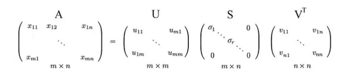
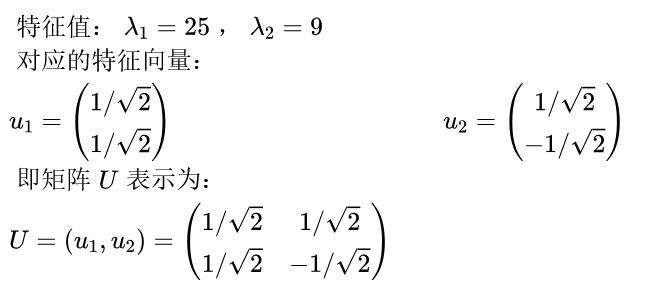
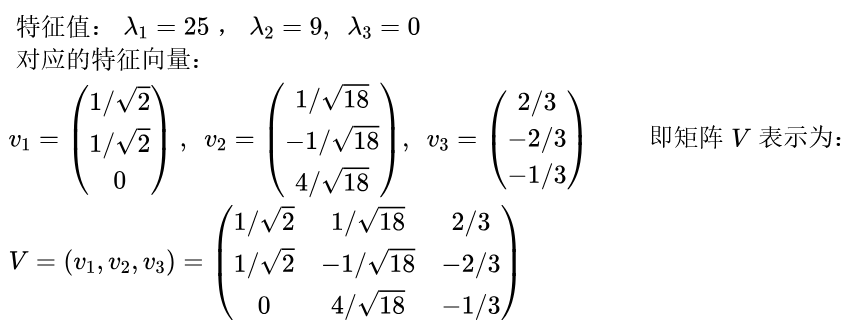
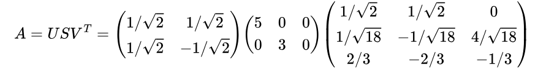

# 奇异值分解（SVD）

线性代数是机器学习领域的基础，其中一个最重要的概念是奇异值分解（SVD），本文尽可能简洁的介绍SVD（奇异值分解）算法的基础理解，以及它在现实世界中的应用。

SVD是最广泛使用的无监督学习算法之一，它在许多推荐系统和降维系统中居于核心位置，这些系统是全球公司如谷歌、Netflix、Facebook、YouTube等的核心技术。

简单来说，SVD是将一个任意矩阵分解为三个矩阵。所以如果我们有一个矩阵A，那么它的SVD可以表示为：
$$
A = USV^T
$$
A是矩阵m×n，U是m×m的正交矩阵，S是m×n的非负对角矩阵，V是n×n的正交矩阵。

U也被称为左奇异向量，S为奇异值，V为右奇异向量。

带维度的奇异值分解：
$$
A_{m \times n} = U_{m \times m} S_{m \times n} V_{n \times n}^T
$$
用矩阵表示奇异值分解：



我们通常将具有较大特征值$\sigma$的向量排列在前，而较小特征值的向量则排在后面。

特征值与向量的对应关系：
$$
\begin{align*}
\sigma_1 &\geq \sigma_2 \geq \cdots \geq \sigma_{m} \\
& \left( \begin{array}{ccc|cc}
 &  &  &  \\
u_1 & \cdots & u_m &  \\
 &  &  &  \\
\hline
\end{array} \right)
\end{align*}
$$
与特征值分解相比，奇异值分解可以应用于非方阵。在SVD中，U和 V 对于任何矩阵都是可逆的，并且它们是正交归一的，这是我们所喜爱的特性。虽然这里不进行证明，但我们可以告诉你，奇异值比特征值在数值上更稳定。

为了更好地理解，我们通过一个例子演示SVD

假设我们有非方阵A：
$$
A = \begin{pmatrix} 
3 & 2 & 3 \\ 
2 & 3 & -2 
\end{pmatrix}
$$
我们计算矩阵与转置矩阵的乘积，有：
$$
\begin{align*}
AA^T &= \begin{pmatrix} 17 & 8 \\ 8 & 17 \end{pmatrix}, & \quad 
A^TA &= \begin{pmatrix} 13 & 12 & 2 \\ 12 & 13 & -2 \\ 2 & -2 & 8 \end{pmatrix}
\end{align*}
$$
求解$AA^T$的特征值和特征向量：



求解$A^TA$的特征值和特征向量：



奇异值是正特征值的平方根，即5和3。因此非方阵A的SVD分解为：



### 对比

| 特性           | SVD                            | PCA                              |
| -------------- | ------------------------------ | -------------------------------- |
| **输入矩阵**   | 任意矩阵（包括非方阵、非对称） | 需中心化的数据矩阵（通常$X^TX$） |
| **分解目标**   | 直接分解原矩阵                 | 分解协方差矩阵                   |
| **计算方式**   | 直接计算 AA 的奇异值           | 先计算 $X^TX$再特征分解          |
| **数值稳定性** | 更高（无需显式计算 $X^TX$）    | 可能因协方差矩阵条件数大而不稳定 |
| **应用场景**   | 推荐系统、图像压缩、降维等     | 数据降维、特征提取               |

```python
# SVD

from numpy.linalg import svd
U, S, Vt = svd(X)  # 直接分解原矩阵

# PCA

from sklearn.decomposition import PCA
pca = PCA(n_components=2)
X_pca = pca.fit_transform(X)  # 内部通过SVD实现
```

### SVD证明

### **（1）构造 $A^TA$ 并特征分解**

- $A^TA$ 是一个 n×n 的对称半正定矩阵（因为$x^{T} A^{T} A x = \| A x \|^{2} \geq 0$）。
- 由**对称矩阵谱定理**，$A^TA$可正交对角化：

$$
A^T A = V \Lambda V^T
$$

其中：

- $V$是正交矩阵（$V^TV$=$I$），其列向量 $vi$ 是 $A^TA$的特征向量。
- $Λ$ 是对角矩阵，对角线元素 $λi$ 是 $A^TA$的特征值（非负）。

### **（2）定义奇异值**

- 设 $σi$=$λi$

$\sigma_{i} = \sqrt{\lambda_{i}}$（因为 $λi≥0$），则：
$$
\Sigma = 
\begin{pmatrix}
\sigma_1 & & & \\
& \sigma_2 & & \\
& & \ddots & \\
& & & \sigma_r \\
& & & 0
\end{pmatrix}_{m \times n}
$$
其中 $r=rank(A)$，且$σ1≥σ2≥⋯≥σr>0$。

### **（3）构造 $U$ 矩阵**

- 对于每个非零奇异值 $σi$，定义：

  $u_i = \frac{1}{\sigma_i} A v_i$

  可以验证：

  $ui^Tuj=δij$

  即$ui$是正交的。

- 如果 $m>r$，补充 $ur+1,…,um$使得$U$成为正交矩阵。

### **（4）验证 $A=UΣV^TA=UΣV^T$**

- 计算：

$$
U\Sigma V^T = \sum_{i=1}^r \sigma_i u_i v_i^T = \sum_{i=1}^r A v_i v_i^T = A \left( \sum_{i=1}^r v_i v_i^T \right)
$$

由于 $V$ 是正交矩阵，$\sum_{i=1}^n v_i v_i^T = I$ ,所以：
$$
UΣV^T=A
$$
